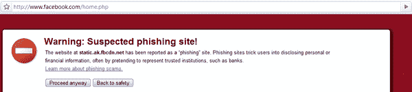

# 谷歌 Chrome 声称脸书可能是一个钓鱼网站

> 原文：<https://web.archive.org/web/https://techcrunch.com/2008/12/03/google-chrome-claims-facebook-may-be-a-phishing-site/>

# 谷歌浏览器声称脸书可能是一个钓鱼网站(更新:Safari 也是)

阴谋论爱好者们将会有一个热闹的日子:当你今天试图使用[谷歌 Chrome](https://web.archive.org/web/20221001190958/http://www.google.com/chrome) 浏览器访问[脸书](https://web.archive.org/web/20221001190958/http://facebook.com/)时，你会得到一个警告，这个社交网络实际上可能是一个钓鱼网站。

如果您单击按钮继续，您仍然可以使用该网站，但您也可以转到“回到安全位置”。它对我来说很好，直到今天早上早些时候。

大家都看到了吗？

**更新:** [这个博客](https://web.archive.org/web/20221001190958/http://emaildeliveryjedi.com/email-blog/uncategorized/facebook-blocked-as-phishing-site-in-firefox-and-chrome/)说火狐也有这个问题，但是我没看到。(当我试图访问 http://fbcdn.net/时，我确实看到了这一点)

人们也收到了这份通知，推特上也在嗡嗡作响。

**更新 2:**fbcdn.net 域名实际上是脸书注册的[域名。](https://web.archive.org/web/20221001190958/http://whois.net/whois_new.cgi?d=fbcdn&tld=net)

**更新 3:** 现在，当社交网络上发出请求时，Safari 似乎也声称脸书是一个可疑的网站。

看起来这更像是脸书方面的问题，而不是与浏览器相关的问题。我们在过去已经看到过针对脸书用户的网络钓鱼诈骗，在[多个](https://web.archive.org/web/20221001190958/http://www.beta.techcrunch.com/2008/01/02/phishing-for-facebook/) [场合](https://web.archive.org/web/20221001190958/http://www.beta.techcrunch.com/2008/03/26/phishing-scam-targeting-facebook-users/)，但这是完全不同的事情。

这可能与脸书连接(他们刚刚[开始推出](https://web.archive.org/web/20221001190958/http://www.beta.techcrunch.com/2008/11/30/facebook-google-myspace-data/)与一群发射合作伙伴)有关，有人对此有什么好的理论吗？

**更新 4:** 这个问题是脸书开发者论坛的讨论话题(这里的和这里的)。一名管理员承认 fbcdn.net 被列为钓鱼网站，但问题现在已经解决，但我仍然会收到警告消息。

**更新 5:** 问题现已解决。