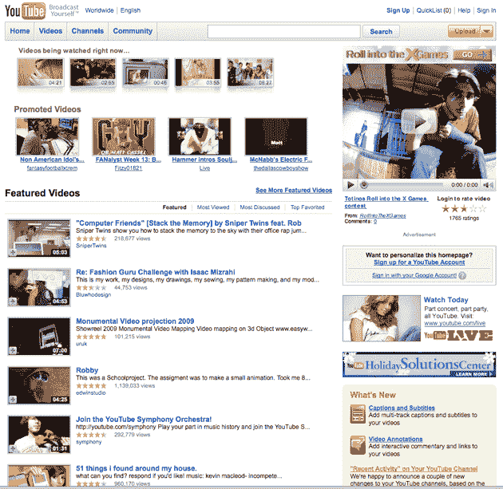

# YouTube 用搜索栏丑化嵌入的视频 TechCrunch

> 原文：<https://web.archive.org/web/https://techcrunch.com/2008/12/03/youtube-uglifies-embedded-videos-with-a-search-bar/>

# YouTube 用搜索栏丑化嵌入的视频

【YouTube http://www.youtube.com/watch?v=6CYkm6f6N2U&hl=en&fs=1]

这是 YouTube 在嵌入视频中添加的一个丑陋的搜索栏(没有警告)。

**更新:**如果想关闭，只需添加参数“& showsearch=0”。更多信息[这里](https://web.archive.org/web/20221007141221/http://code.google.com/apis/youtube/player_parameters.html)。

此外，网站本身也进行了改版，但我并不喜欢:

