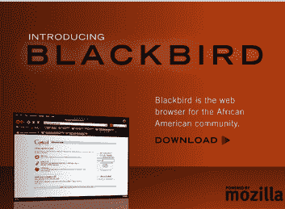

# Blackbird 是一款基于 Mozilla TechCrunch 的非裔美国人定制浏览器

> 原文：<https://web.archive.org/web/https://techcrunch.com/2008/12/08/blackbird-is-a-custom-browser-for-african-americans-built-on-top-of-mozilla/>

# Blackbird 是一款基于 Mozilla 的非裔美国人定制浏览器

Blackbird 是一款基于 Mozilla 技术的新浏览器，旨在让非裔美国人更容易发现网络上的相关内容，并通过浏览器分享故事、新闻、评论和视频，与非裔美国人社区的其他成员进行在线互动。

该浏览器在顶部显示一个预设的新闻滚动条，从谷歌新闻(Google News)获取非裔美国人可能感兴趣的新闻内容，并有一个部分显示来自 UptownLiveTV、NSNewsTV、DigitalSoulTV 和 ComedyBanksTV 等在线电视网站的视频内容。除此之外，还有很多与最流行的社交网络的集成，一个“黑色搜索”，预设的“黑色书签”等等。还有一个“回馈”计划，简化了对许多非营利组织的捐赠(Blackbird 也打算将其 2009 年收入的 10%捐赠给这些合作伙伴)。

在某种程度上，Blackbird 感觉更像是一个皮肤版的 [Flock](https://web.archive.org/web/20230121173908/http://flock.com/) (他们过去也为特定受众创建过版本，例如，见针对女性的 [Gloss](https://web.archive.org/web/20230121173908/http://browser.flock.com/gloss) )而不是其他任何东西，特别是因为它与社交网站和应用程序有着密切的联系。正如我偶然发现 Flock 的 Gloss edition 时所想的那样，我不完全确定对于非裔美国人来说，下载并安装一个全新的浏览器是否足够，因为所有的定制工具都已经内置在最新版本的流行浏览器应用程序中。

话说回来，我肯定不是目标受众，所以不好判断。任何非裔美国读者谁想尝试一下，并回来在这里评论部分权衡？请注意，它只能在 Windows 机器上运行。

(帽子戏法颁给迈克·斯特里特，他也写了一篇对这款浏览器的评论)