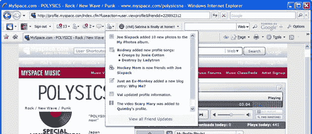

# MySpace 将于周三推出 MySpace 工具栏 TechCrunch

> 原文：<https://web.archive.org/web/https://techcrunch.com/2008/12/09/myspace-to-launch-myspace-toolbar-on-wednesday/>

# MySpace 将于周三推出 MySpace 工具栏

MySpace 今天发布了一些公告。除了 [MySpaceID](https://web.archive.org/web/20230129023142/http://techcrunch.com/2008/12/08/myspace-data-availability-now-has-a-catchier-name-and-two-new-partners/) ，该公司还将宣布推出用于 ie 浏览器和 Firefox 的 *MySpace 工具栏*。目前，只有 Windows 用户能够运行 MySpace Toolbar——Mac 版很快就会推出。

工具栏将有效地让 MySpace 用户保持登录状态，无论他们是否在网站上。认证和数据传输完全通过公开可用的 API 和产品完成，统称为 MySpace 开放平台。

工具栏用户打开浏览器时会自动登录 MySpace。他们还会看到 MySpace 的数据流，包括通知、朋友活动以及他们自己和朋友的情绪和状态。工具栏还将包括一个谷歌驱动的搜索网页和 MySpace 的栏。

MySpace 的首席运营官·阿米特·卡普尔表示，任何第三方开发者都可以使用 MySpace 的开放平台来构建这个平台，该公司将鼓励实验。

该工具栏将首先提供给美国、英国、澳大利亚、加拿大、新西兰、印度和爱尔兰的用户。