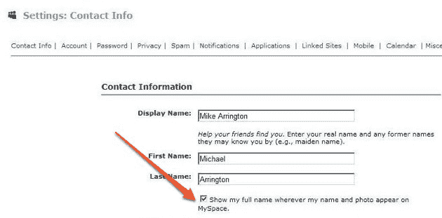

# MySpace 悄悄开始鼓励用户使用真实姓名 TechCrunch

> 原文：<https://web.archive.org/web/https://techcrunch.com/2008/12/17/myspace-quietly-begins-encouraging-users-to-use-their-real-names/>

# MySpace 悄悄地开始鼓励用户使用他们的真实姓名

对 MySpace 的一个经常性的批评是，当你在网站上查看某人的个人资料或与他们互动时，真实姓名是隐藏的。他们现在正在对产品进行微妙的改变，鼓励用户在网站上显示他们的真实姓名。

当你不想让你的真实身份妨碍你在网上的任何幻想生活时，匿名是很好的选择。但这也是用真实姓名识别用户的脸书在 MySpace 上迅速崛起的原因之一。在脸书，你通常知道你在和谁说话。在 MySpace 上，谁也说不准。

在 MySpace 成长的最初几年，这种匿名方式非常适合它。但是 2009 年将会是关于社交网络身份和在网络上传播的一年。MySpace、脸书和谷歌都希望用户使用自己的账户凭证登录第三方网站，而让这些账户与真实姓名相关联是一种竞争优势。

脸书在这方面已经有了很大的领先优势，脸书连接了 T4，任何想要使用它的第三方网站都可以使用 T5。谷歌也推出了自己的[产品](https://web.archive.org/web/20221203185751/http://www.beta.techcrunch.com/2008/12/04/google-friend-connect-now-open-to-all-websites/)，并且[正在与 Twitter](https://web.archive.org/web/20221203185751/http://www.beta.techcrunch.com/2008/12/15/twitter-google/) 等网站整合。

MySpace 正在努力将 MySpaceID(以前的数据可用性)发布给合作伙伴。

MySpace 还在帐户设置中增加了一个功能，询问用户是否希望在他们的个人资料上显示他们的真实姓名以及他们选择的任何显示名称(所以 MySpace 首席运营官[阿米特卡普尔的 MySpace 页面](https://web.archive.org/web/20221203185751/http://profile.myspace.com/index.cfm?fuseaction=user.viewProfile&friendID=10004)现在显示他的真实姓名，而以前没有)。

添加新朋友时，MySpace 用户还会被提示透露他们的真实姓名(见上图)。

所有这些都是为了用真实人物的真实名字来合法化 MySpace 混乱的命名空间。如果他们成功地让大部分用户透露他们的姓名，他们将削弱脸书在这一领域的优势。随着时间的推移，我会期待更多，而不是更少。