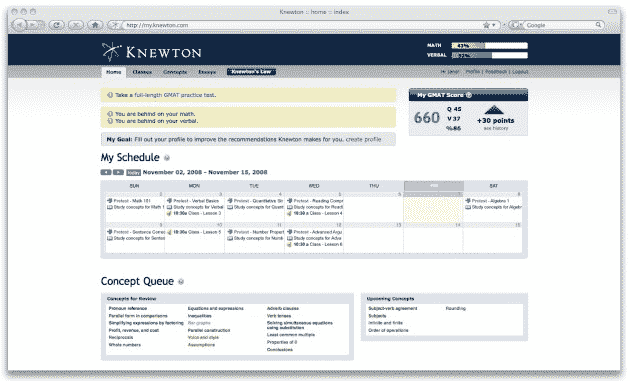
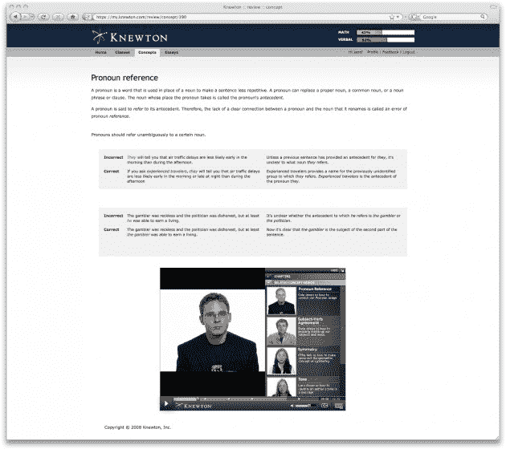
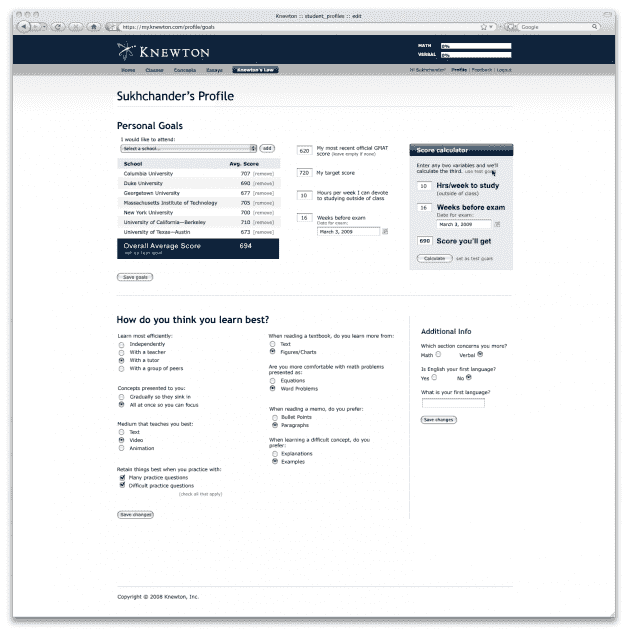

# Knewton 将适应性学习提升到新的水平 TechCrunch

> 原文：<https://web.archive.org/web/https://techcrunch.com/2008/12/23/knewton-takes-adaptive-learning-to-the-next-level/>

教科书已经过时了。然而学生的背包仍然被它们压得很重。用软件取代教科书是计算领域的大白鲸之一，这至少可以追溯到 40 年前艾伦·凯最初的[动画本](https://web.archive.org/web/20230204210751/http://en.wikipedia.org/wiki/Dynabook)概念(他仍在从事这项工作)。今天，有许多创业公司在解决电子学习的问题( [Brightstorm](https://web.archive.org/web/20230204210751/http://www.brightstorm.com/) 、 [iKnow](https://web.archive.org/web/20230204210751/http://www.iknow.co.jp/) 、 [Grockit](https://web.archive.org/web/20230204210751/http://www.grockit.com/) 、 [PrepMe](https://web.archive.org/web/20230204210751/http://www.prepme.com/) )，并且取得了一些进展。

唾手可得的果实似乎是[备考](https://web.archive.org/web/20230204210751/https://techcrunch.com/2007/09/01/starts-ups-change-how-students-study-for-tests/)和[视频教程](https://web.archive.org/web/20230204210751/https://techcrunch.com/2008/10/21/brightstorm-raises-6-million-for-online-video-tutorials/)，但随着时间的推移，更大的奖励将是增加或取代印刷教材，并越来越多地渗透到全球教育市场。一家雄心勃勃的小型创业公司是 Knewton。

Knewton 总部位于纽约市，去年 5 月从 Accel Partners、首轮资本、雷德·霍夫曼、罗恩·康韦和其他天使投资人那里筹集了 250 万美元。该公司非常低调，直到上个月成为亚马逊网络服务创业挑战赛的决赛选手(见下面的视频)。该公司完全建立在亚马逊的云计算服务之上(EC2 用于计算，S3 用于存储视频教程，Mechanical Turk 用于微调测试问题)。~~目前，它在创业挑战赛的投票中领先，获得了 51%的选票。(当然，这种在线投票很容易玩)。~~事实上，创业挑战已经有了赢家: [Yieldex](https://web.archive.org/web/20230204210751/https://techcrunch.com/2008/11/21/yieldex-takes-top-prize-in-amazon-web-services-startup-challenge/) 。不过，Knewton 确实赢得了普选。

创始人兼首席执行官何塞·费雷拉曾是考试准备巨头卡普兰的高管。Knewton 的两位首席测试设计师 Len Swanson 和 Robert McKinley 分别为教育考试服务中心(管理 SAT、GRE 和 AP 考试)和 ACT 编写了自适应学习测试的评分算法。

适应性学习测试在计算机上进行。根据每个学生的回答，问题会变得越来越难或越来越容易。因此，他们适应每个学生的知识和能力。Knewton 采用了适应性学习的概念，并首先将其应用于在线备考服务。它不便宜。目前，它提供为期一年的订阅服务，为 GMAT 测试做准备，费用为 1390 美元。该公司保证学生的考试成绩至少提高 50 分，否则会退款。

该服务结合了在白板环境中与讲师的实时视频聊天，以及自学的示例问题和教程。Knewton 找到了它能找到的最好的老师，每小时付给他们 500 到 800 美元。除了虚拟教室，Knewton 还跟踪每个学生在掌握每次考试中可能涉及的一千多个概念方面的进展。一个“概念队列”让学生们及时了解他们已经掌握了哪些概念，哪些概念是他们的弱项。他们可以点击每个概念标签深入了解。(见下面截图)。

一个大的“Knewton 定律”按钮会自动显示每个学生在特定时刻准备好的下一个概念和教程，基于他们已经覆盖的内容和他们目前为止的学习情况。内容以任何形式(文本、视频、动画)和难度水平交付，学生从该特定概念中学习效果最佳。

一个彩色编码的进度条告诉他们在不同类别中的表现，如数学或语言。Knewton 还根据学生实际回答的问题，向他们展示如果他们当天参加考试，他们的分数会是多少。学生还会收到关于即将到来的课程、作业截止日期、办公时间等的提醒。

Knewton 计划将业务扩展到 GMAT 以外的其他标准化考试，但真正的大机会是将其学习引擎直接应用于在线教科书。费雷拉解释了这个概念:

> 我们将内容标记到原子级别。例如，一个使用数字教科书的学生，他们每天都来，而不是每天都有相同的教学大纲，他们会根据他们知道和不知道的概念得到一个新的教学大纲。如果他们通过视频学得最好，他们就会明白。如果他们通过文本学习得最好，他们就会明白。

费雷拉说，几家大大小小的教科书出版商正在与 Knewton 讨论寻求合作关系。将适应性学习技术融入教科书，有朝一日会让在线版本的教科书成为比离线版本更好的学习工具。不是每个人都以同样的方式学习，教科书行业今天采取的一刀切的方法需要改变。

但是，用正确的软件修改过的教科书，凭其自身的能力能成为好老师吗？这样一个未来的前景提出的不仅仅是教育问题。如果 Knewton 这样的软件威胁到他们的工作，教师工会可能会大发雷霆，但这个国家的教育是如此的破碎，以至于任何让学生变得更聪明的事情都应该被张开双臂拥抱。当然，除非教科书在网上的价格是 1000 美元，而不是 100 美元的印刷版。

(更多关于电子学习创业公司的报道，请阅读我们对 [TC50 决赛选手 Grockit](https://web.archive.org/web/20230204210751/https://techcrunch.com/2007/07/24/grockit-raises-cash-prepares-massive-multiplayer-online-learning-product/) 和[日本 iKnow](https://web.archive.org/web/20230204210751/https://techcrunch.com/2008/10/15/iknow-is-a-social-learning-platform-that-can-really-make-you-smarter-opens-api/) 的简介)。

