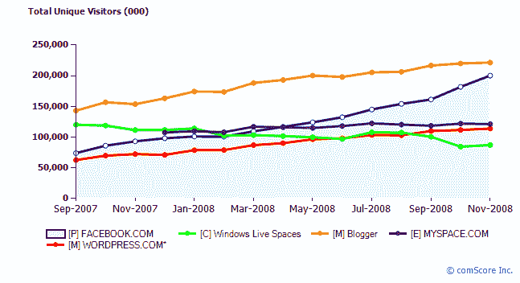
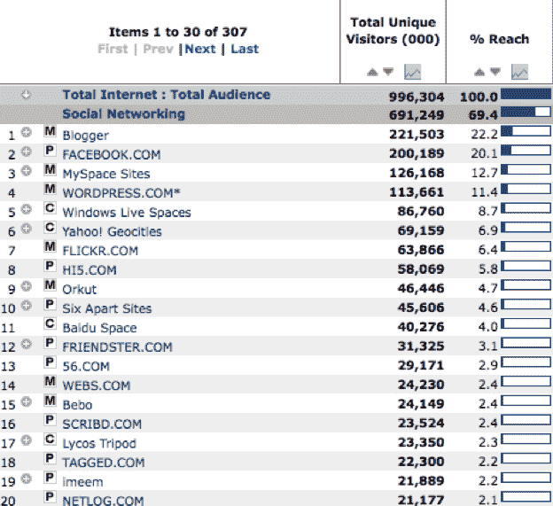

# 2008 年顶级社交媒体网站(脸书仍在崛起)

> 原文：<https://web.archive.org/web/https://techcrunch.com/2008/12/31/top-social-media-sites-of-2008-facebook-still-rising/>

# 2008 年顶级社交媒体网站(脸书仍在崛起)

2008 年最热门的社交媒体网站有哪些？几天前，ComScore 发布了 11 月份的全球流量统计(所以不包括 12 月)。它们是社交网络和博客平台的混合体。Blogger(上图中的橙色线)仍然独占鳌头，11 月份全球独立访客估计达到 2.22 亿(比 2007 年 11 月增长了 44%)。蓝线脸书的独立访客将达到 2 亿(增长 116%)，很快就会超过这条线。(不过，请注意，这比脸书自己报告的 1.4 亿活跃用户还要多——这是个数字)。MySpace 相当稳定，有 1.26 亿唯一用户。WordPress 紧随其后，拥有 1.14 亿用户(增长 68%)。Windows Live Spaces 下降了 22 %,只有 8700 万个唯一共享空间。

ComScore 保留了一份它称之为“社交网络”网站的清单，但这些网站也包括博客平台和其他社交媒体网站。虽然博客的受众总体上仍在健康增长，但脸书作为社交大猩猩脱颖而出，不仅从其他社交网络，还从博客和其他社交媒体那里夺取了份额。

以下是 comScore 社交网站排行榜上排名前 20 的网站。它实际上更像是一个社交媒体网站列表，这也是我在这篇文章中给它重新命名的原因。这不是决定性的，但它给出了一个很好的土地布局。(这是 2007 年类似的[排名)。值得注意的是，雅虎的 Geocities 顽固地保持在第 6 位，雅虎的 Flickr 上升到第 7 位，排名第 10 位，还有百度空间和 56.com 等中国网站的存在。然而，真正令人惊讶的是排名第 16 位的文档共享网站 Scribd，它在全球拥有近 2400 万用户。](https://web.archive.org/web/20230307231825/https://techcrunch.com/2007/10/24/social-site-rankings-september-2007/)

**顶级社交媒体网站**(根据 2008 年 11 月全球唯一访问者排名；comScore)

1.  博客作者(2.22 亿)
2.  脸书(2 亿)
3.  MySpace(1.26 亿)
4.  WordPress(1.14 亿)
5.  Windows Live 共享空间(8700 万)
6.  雅虎地理城市(6900 万)
7.  Flickr(6400 万)
8.  hi5(5800 万)
9.  orkut(4600 万)
10.  六个分开(4600 万)
11.  百度空间(4000 万)
12.  friendster(3100 万英镑)
13.  56.com(2900 万)
14.  Webs.com(2400 万)
15.  贝博(2400 万)
16.  scribd(2300 万)
17.  Lycos 三脚架(2300 万英镑)
18.  已标记(2200 万)
19.  imeem(2200 万)
20.  网络日志(2100 万)

下面是实际数据的截图(如你所见，我在上面四舍五入了):

