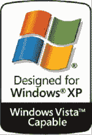

# 支持 Windows Vista 的贴纸可能是微软的摇钱树 TechCrunch

> 原文：<https://web.archive.org/web/https://techcrunch.com/2009/01/04/windows-vista-capable-stickers-might-have-been-a-microsoft-cash-cow/>

# 支持 Windows Vista 的贴纸可能是微软的摇钱树

 几年前，在光线昏暗的微软董事会会议室深处，几个出价过高的营销工具想出了“Vista Capable”这个词。在 Vista 大张旗鼓地发布之前，这个绰号将被贴在新电脑上。这样的话，消费者会感到温暖和模糊，因为他们知道他们的新电脑将能够升级到 glorious Vista，并且可以运行 honky dory。我们都知道结果如何。但是 didja 知道因为这些小贴纸微软可能已经赚了超过 15 亿美元吗？

微软目前正因这一可疑的指控而对簿公堂，而这一诱人的细节正是在这里被披露的。据专家基思·莱弗勒称，

> 原告律师要求我估计微软从出售给原告的支持 Vista 但不支持 Vista Premium Ready 的个人电脑上的 Windows XP 许可中获得的收入。在微软的补充回复中，它估计在 2006 年 4 月至 2007 年 1 月期间，它从在美国销售的可升级个人电脑的 Windows XP 许可中获得了[redacted]的收入。根据表 1 中对支持 Windows 但不支持 Vista Premium 的 PC 与所有可升级 PC 的比较，我估计可升级 PC 上 Windows XP 许可证的[修订]是针对支持 Vista 但不支持 Vista Premium 的 PC 的 XP 许可证，即原告类别购买的 PC。从这些数字中，我得出的结论是，微软从出售给原告的支持 Vista 但不支持 Vista Premium Ready 的个人电脑上获得的 Windows XP 许可收入为 15.05 亿美元。

让你想知道微软有多希望 Windows 7 成功。足以让所有人都忘记 Vista。Windows ME 在 XP 推出后很快就被遗忘了所以可以做到。