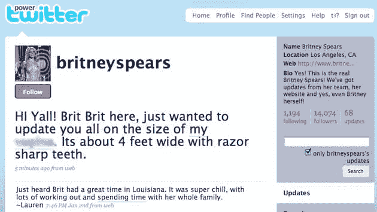
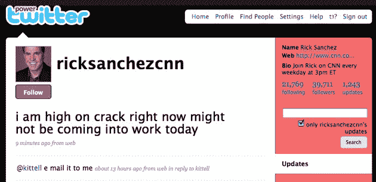
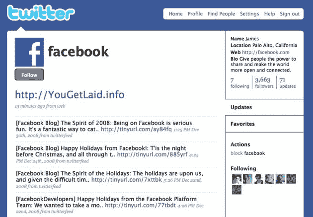
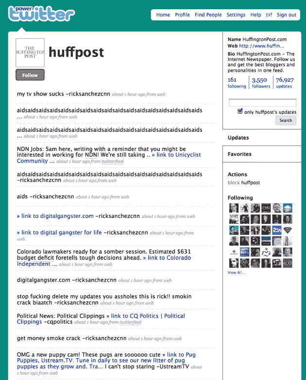
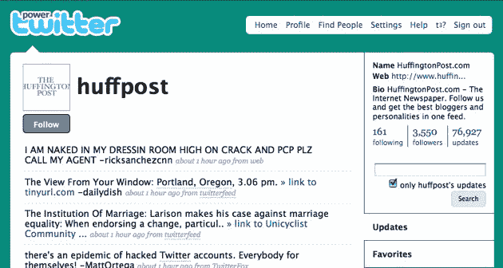

# 名人推特账户被黑(比尔·奥雷利、布兰妮、欧巴马等)

> 原文：<https://web.archive.org/web/https://techcrunch.com/2009/01/05/either-fox-news-had-their-twitter-account-hacked-or-bill-oreilly-is-gay-or-both/>

# 名人推特账户被黑(比尔·奥雷利，布兰妮，欧巴马，等等)

我的猜测是，这与几天前在 Twitter 上开始的[网络钓鱼攻击](https://web.archive.org/web/20230403221505/http://blog.twitter.com/2009/01/gone-phishing.html)无关。但是几分钟前，福克斯新闻频道官方推特账户发布了“爆料:比尔·O·赖利是同性恋”(指的是受欢迎的福克斯节目《奥赖利因素》的主持人)，就在一条关于制作[火鸡生菜卷](https://web.archive.org/web/20230403221505/http://twitter.com/foxnews/status/1097362611)的合法信息之后。

我猜他们现在才发现，并意识到他们的密码，可能是“密码”，已经被更改了。我敢肯定，Twitter 会迅速将该账户归还给它的合法所有者。但我的问题是——如果你的 Twitter 账户被黑了，你花了多长时间才恢复？

**更新:**好吧，这变成了一次协同攻击，或者说是一种巧合。布兰妮官方推特账户(于 10 月[开通](https://web.archive.org/web/20230403221505/https://techcrunch.com/2008/10/19/omg-britney/))似乎也被其他人黑过？

**更新 2:** 我们又有了一个赢家:[CNN 的里克·桑切斯](https://web.archive.org/web/20230403221505/http://ricksanchez.blogs.cnn.com/)，他今天显然不会去上班了，因为他“现在正处于兴奋状态”

**更新 3:** [Et Tu](https://web.archive.org/web/20230403221505/http://twitter.com/christinelu/statuses/1097597215) ，[脸书](https://web.archive.org/web/20230403221505/http://twitter.com/facebook)？(见奥巴马账户奖金黑客评论)

**更新 4:** 下一个！[赫芬顿邮报](https://web.archive.org/web/20230403221505/http://twitter.com/huffpost)也倒下了:

**更新 5:** 推特内部管理工具[被攻破](https://web.archive.org/web/20230403221505/https://techcrunch.com/2009/01/05/twitter-gets-hacked-badly/)后，33 个账号被黑。