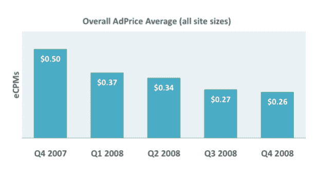
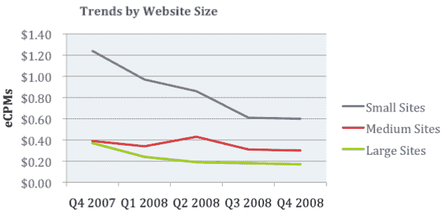
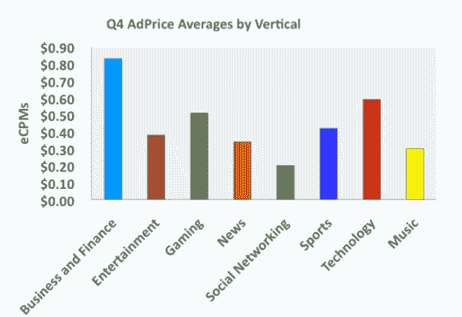

# PubMatic:剩余广告价格是一年前的一半 TechCrunch

> 原文：<https://web.archive.org/web/https://techcrunch.com/2009/01/13/pubmatic-remnant-ad-prices-are-half-what-they-were-a-year-ago/>

# 剩余广告价格是一年前的一半

第四季度的数据开始显示出在线广告的低迷有多糟糕。最新数据来自于 [Pubmatic](https://web.archive.org/web/20221226015718/http://www.pubmatic.com/) ，这是一个在线广告优化服务，被大大小小 5000 多个网站使用。我获得的 PubMatic 第四季度广告价格指数显示了向这些网站支付的剩余展示广告库存(即他们无法以更高价格出售的库存)的平均价格。

2008 年第四季度，所有网站的剩余广告平均价格为每千次展示 0.26 美元，比 2007 年第四季度下降了 48%，比第三季度下降了 1 美分。通常情况下，由于假期的原因，第三和第四季度之间会有一个巨大的跳跃，所以这不是一个好的迹象。

Pubmatic 将其数据分为小型(每月不到 100 万次浏览量)、中型(100 万到 1 亿次浏览量)和大型网站(超过 1 亿次浏览量)。大型网站的有效 CPMs 为 0.17 美元，中型网站为 0.30 美元，小型网站为 0.61 美元，均与第三季度持平或下降 1 美分。

剩余库存广告率最高的垂直类别是商业和金融(0.83 美元，同比下降 61%)，技术(0.59 美元，同比下降 41%)和游戏(0.51 美元，同比上升 31%)。体育网站的收入为 0.40 美元(比一年前下降了 8.7%)，娱乐网站的收入为 0.38 美元(下降了 40%)，新闻网站的收入为 0.34 美元(下降了 36%)，音乐网站的收入为 0.30 美元(下降了 61.5%)，排名垫底的是社交网络，收入为 0.20 美元(下降了 54%)。

有些事情告诉我，今年我们不需要 300 家不同的广告网络到处兜售相同的广告，并从他们的努力中获得 30%到 40%的回报。

