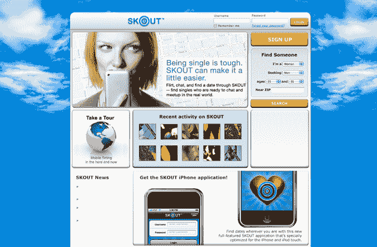

# Skout 希望帮助你用你的 iPhone 找到真爱 TechCrunch

> 原文：<https://web.archive.org/web/https://techcrunch.com/2009/01/16/skout-hopes-to-help-you-find-true-love-with-your-iphone/>

# Skout 希望帮助你用 iPhone 找到真爱

类似于 [Loopt](https://web.archive.org/web/20221002134201/http://www.loopt.com/) 和 [BrightKite](https://web.archive.org/web/20221002134201/http://brightkite.com/) 的基于位置的社交网络 Skout 已经决定采取一种新的基于移动的网络方式。结合即将发布的第一款 iPhone 应用程序，该网站决定放弃其作为标准社交网络的角色，而是将自己重塑为 iPhone 首批基于位置的约会服务之一。

首席执行官 Christian Wiklund 表示，基于位置的功能正日益成为一种商品，网络将不得不采取一些措施来区分自己。虽然一些较大的网络确实提供一些涉及调情和结识新朋友的功能，但 Wiklund 说，因为这些只是次要功能，人们可能会较少使用它们。

iPhone 应用程序计划在下周发布(你可以在下面看到它的预览)，似乎与我们从 Loopt 和 BrightKite 看到的应用程序没有太大区别——似乎最大的区别将在于其用户的意图。

为了配合新的 iPhone 应用程序，Skout 还将修改其主页，以反映其新目标。幸运的是，Wiklund 表示，Skout 的 20，000 名活跃用户中有 83%已经在使用该网络进行约会和调情，所以这种转变应该不会太不和谐。该公司还引进了一批新的顾问来帮助指导其作为约会网站的新定位，其中包括 Match.com 创始人加里·克里门。

我认为 iPhone 和其他智能手机上的约会应用程序有一个明确的市场，但我怀疑是否有另一个约会网络的需求——许多人已经属于 Match.com 和 eHarmony 这样的老牌网站，不会急于处理另一个网站。但是，如果 Skout 能够与这些已建立的网站建立合作伙伴关系，提供白标应用程序或将其帐户导入 Skout，那么它就可以为自己做得很好(该网站已经与一些网站进行了谈判，但不会透露是谁)。

【YouTube http://www.youtube.com/watch?v=muclZvWcdhs&hl=en&fs=1]

