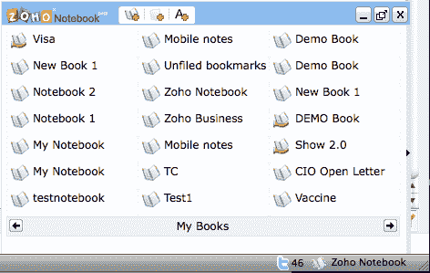

# Zoho 寻求利用谷歌笔记本关闭带来的便利

> 原文：<https://web.archive.org/web/https://techcrunch.com/2009/01/20/zoho-seeks-to-capitalize-on-closure-of-google-notebook-with-easy-import/>

# Zoho 寻求利用谷歌笔记本关闭容易进口

明天早上，Zoho 将宣布将[谷歌笔记本](https://web.archive.org/web/20221208041128/http://www.google.com/notebook)迁移到 [Zoho 笔记本](https://web.archive.org/web/20221208041128/http://www.zohonotebook.com/)的新导入功能。这是紧随谷歌决定停止谷歌笔记本开发和停止添加新账户之后。

同样更新的还有 Zoho 笔记本的 [Firefox 扩展。与 Delicious 非常相似，Zoho 扩展通过弹出菜单提供笔记本访问。方便的功能包括网页截图-整个页面和特定的选择，快速添加文本，以及同步复制您的笔记本。](https://web.archive.org/web/20221208041128/http://notebook.zoho.com/nb/ext/zoho_notebook_helper-1.0b2.xpi)

迁移很简单，因为 Zoho [允许使用你的 Google 账户](https://web.archive.org/web/20221208041128/http://www.beta.techcrunch.com/2008/05/13/zoho-no-longer-requires-accounts-sign-in-with-yahoo-or-google-ids/)登录。只需用你的 Google ID 登录 Zoho，安装新的 Firefox 扩展，并在访问你的 Google Notebook 帐户时输入命令。更多详情 [Zoho 的博客](https://web.archive.org/web/20221208041128/http://blogs.zoho.com/notebook/google-notebook-import-new-zoho-notebook-plug-in-more/)。

