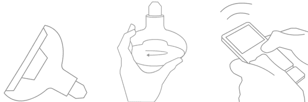

# 灯泡声音扬声器将您的音乐放入您的...lamp TechCrunch

> 原文：<https://web.archive.org/web/http://techcrunch.com/2009/01/22/bulb-sound-speaker-puts-your-music-in-your-lamp/>

# 灯泡-音响-扬声器将您的音乐放入您的…灯中

这是一个非常棒的想法。由[卡斯蒂利奥内·莫雷利](https://web.archive.org/web/20230203151006/http://www.castiglionemorellidesign.it/)设计的灯泡声音扬声器，正如你可能从名字中猜到的，它实际上是一个扬声器。它的供电方式与灯泡相同，通过拧入位，然后是蓝牙收发器和 Altec Lansing 扬声器。你把装置的另一部分插入你的 iPod，你就有了它，声音从你的灯具里传出来。

现在，我知道有些人可能会认为这个*真的很蠢。但是，你是个笨蛋。我认为这很棒，尽管如果你正确规划了你的房子或公寓，不应该有任何你想让声音到达不了的地方。但是对于书房或阅读椅，你更喜欢有一点点自己的音乐，而不想在自己家里戴耳机(没错！)，这是个很酷的小玩意。*

[通过 [NotCot](https://web.archive.org/web/20230203151006/http://www.notcot.org/post/18302/)