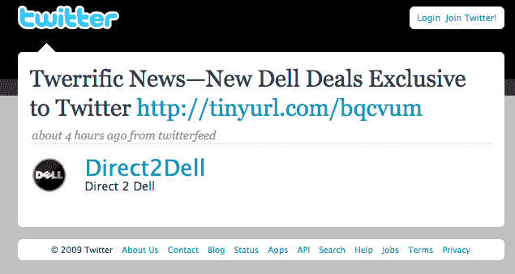
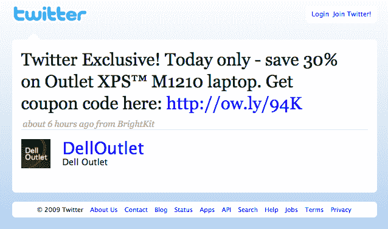
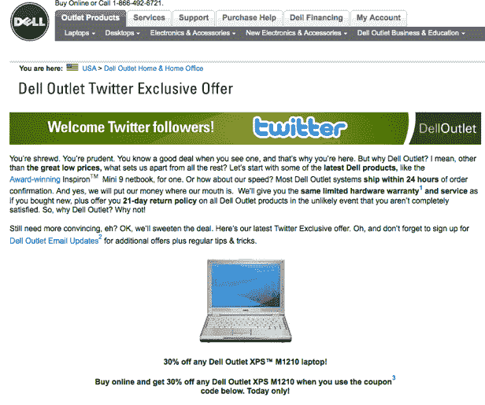

# 戴尔开始通过 Twitter | TechCrunch 提供独家折扣

> 原文：<https://web.archive.org/web/https://techcrunch.com/2009/02/03/dell-starts-offering-exclusive-discounts-through-twitter/>

# 戴尔开始通过 Twitter 提供独家折扣

戴尔的 Twitter 实验似乎正在奏效。在假期通过提醒 Twitter 关注者销售商品赚了[100 万美元之后，戴尔现在向关注](https://web.archive.org/web/20230325092253/http://venturebeat.com/2008/12/15/twitter-has-made-dell-1-million-in-revenue/) [@DellOutlet](https://web.archive.org/web/20230325092253/http://twitter.com/DellOutlet) 的 11844 人提供*独家*折扣。例如，这里有一条推文，链接到 XPS 笔记本电脑上的[30%折扣交易](https://web.archive.org/web/20230325092253/http:///)。当你点击链接时，它会把你带到 Dell.com 的这个[产品页面。](https://web.archive.org/web/20230325092253/http://www.dell.com/content/topics/global.aspx/community/dell_super_savings?c=us&cs=22&l=en&s=dfh&redirect=2&dgc=BA&cid=22576&lid=1028296)

当然，新的营销计划是在 Twitter 和 Direct2Dell 博客上发布的:

> *从今天开始，戴尔将在美国的 Twitter 独家提供戴尔商店的交易。我们的团队拥有超过 11，000 名粉丝，我们希望通过这些每周都会继续的新交易向 Twitter 世界表示感谢。*

在 Twitter 上注册一封本质上是营销邮件的邮件，可能会让一些消费者感觉自己是一个高级俱乐部的成员。(太排外了，谁都可以加入)。或者，他们只是不想让这些垃圾邮件塞满他们的收件箱，只有在他们想购买戴尔产品时，他们才会选择关注这些邮件。

作为营销渠道的 Twitter。嗯，。。。一定有收费的方法。

