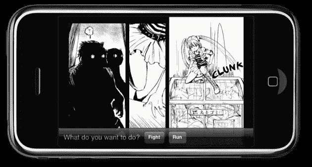
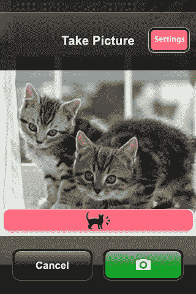
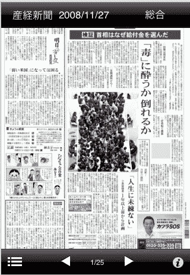

# 东京 Meetup 笔记:日本最酷(也最古怪)的初创公司 TechCrunch

> 原文：<https://web.archive.org/web/https://techcrunch.com/2009/02/04/tokyo-meetup-notes-japans-coolest-and-weirdest-startups/>

 
*图片鸣谢:名川优彦(更多活动照片可在[这里](https://web.archive.org/web/20221006013542/http://www.flickr.com/photos/namekawa/sets/72157613343716478/)和[这里](https://web.archive.org/web/20221006013542/http://www.flickr.com/photos/delphiekr/tags/techcrunch/) )*

我们昨天晚上在东京的第一次 TechCrunch/CrunchGear 见面会( [TechCrunch Japan](https://web.archive.org/web/20221006013542/http://jp.beta.techcrunch.com/) 是日本的主要博客之一)非常热闹。彼得·哈在城里，在很短的时间内有 100 多人参加了活动，包括来自雅虎日本、电信巨头 KDDI、NTT、Opera、MySpace 日本、移动社交网络和许多其他公司的代表。日本超级博主 Danny Choo 也加入其中，整晚都穿着冲锋队的装备。

房间里有很多公司都有 iPhone 应用程序:iPhone manga、iPhone Othello、iPhone Meow Cam，甚至还有一份 iPhone 报纸。以下是一些小型初创公司昨天向我推荐的一些网络服务和 iPhone 应用(排名不分先后)。下次我们真的需要为这些活动安排两个多小时。

 **创业一号:**
[iPhone 应用、虚拟世界和社交媒体项目开发者 Genkii](https://web.archive.org/web/20221006013542/http://genkii.com/) 赠送[一枚硬币漫画](https://web.archive.org/web/20221006013542/http://comics.genkii.com/)。iPhone 平台将于本月推出一部名为“火狐”的多语言互动漫画。除了发布原创漫画项目，Genkii 告诉我，他们将在今年春天向其他作家和艺术家开放平台。然后艺术家可以通过 One Coin Comics 将完成的艺术作品提交给 Genkii 进行组装和发布，并分享收入。

**创业二号:**
~~CEO~~CTO tachi zono Masahiko 告诉我，他的网站 [Natalie](https://web.archive.org/web/20221006013542/http://natalie.mu/en) 可能是网络上关于日本英语流行音乐新闻的主要枢纽。与类似的网站不同，所有的新闻都是直接从东京发布的，网站每天都会更新几次。Tachizono 还表示，他目前正在寻找战略合作伙伴，以扩大分销，特别是日本以外的地区。娜塔莉也可以作为一个[脸书应用](https://web.archive.org/web/20221006013542/http://apps.facebook.com/natalie/)(英文)。
 **创业三号:**
[digi dock](https://web.archive.org/web/20221006013542/http://digidock.co.jp/en/home)是一家 iPhone 开发公司，目前在[iTunes app store](https://web.archive.org/web/20221006013542/http://digidock.co.jp/en/iphoneapplication/reversisister)(英文)中销售【黑白棋姐姐，一款相当独特的版本的黑白棋([一款桌游，又名奥赛罗](https://web.archive.org/web/20221006013542/http://en.wikipedia.org/wiki/Reversi))。这款游戏富含动漫风格的音频和图像，实际上非常有趣，售价 2.99 美元。看一个黑白棋妹子演示视频[这里](https://web.archive.org/web/20221006013542/http://jp.youtube.com/watch?v=X_W16hlYKu0)。

[T31](https://web.archive.org/web/20221006013542/http://digidock.co.jp/en/iphoneapplication/reversisister)

**创业四号:**
[MyGengo](https://web.archive.org/web/20221006013542/http://mygengo.com/)提供众包人工翻译(目前只有英文和日文)。在将文本上传或粘贴到订单中后，用户将收到即时定价，以订购他们选择的质量级别，并在几个小时内通过该网站收到完整的翻译。首席执行官 Robert Laing 告诉我，他的公司依靠外包的预测试母语翻译网络来降低业务成本，他声称用户可以通过这种方式节省高达 70%的翻译成本。

**创业第五名:**
[Appliya](https://web.archive.org/web/20221006013542/http://appliya-inc.com/en/)just[昨天宣布与](https://web.archive.org/web/20221006013542/http://appliya-inc.com/en/press/#appliya_anime)[软银移动](https://web.archive.org/web/20221006013542/http://www.softbankmobile.co.jp/en/)(日本第三大手机运营商)合作，旨在将带有日本风味的 iPhone 应用推向全球市场。到目前为止，该公司已经发布了 26 款 iPhone 应用。Appliya 昨天给我看的是[喵凸轮](https://web.archive.org/web/20221006013542/http://appliya-inc.com/en/catalog/meowcam/)。[下载它](https://web.archive.org/web/20221006013542/http://click.linksynergy.com/fs-bin/stat?id=2TPfw*86M8Y&offerid=94348&type=3&subid=0&tmpid=2192&RD_PARM1=http%253A%252F%252Fphobos.apple.com%252FWebObjects%252FMZStore.woa%252Fwa%252FviewSoftware%253Fid%253D294019549%2526mt%253D8%2526partnerId%253D30) ($0.99)当你按下喵喵按钮时 iPhone 喵喵叫，导致一只被拍摄的猫朝相机方向看([视频](https://web.archive.org/web/20221006013542/http://www.youtube.com/watch?v=5IhpI5YAeOA&eurl=http://appliya-inc.com/en/catalog/meowcam/&feature=player_embedded))。同样售价 0.99 美元的[婴儿摄像头](https://web.archive.org/web/20221006013542/http://appliya-inc.com/en/catalog/babycam/)是相应的婴儿应用([视频](https://web.archive.org/web/20221006013542/http://www.youtube.com/watch?v=m-ZO4igO7-8&eurl=http://appliya-inc.com/en/catalog/babycam/&feature=player_embedded))。 [Ghost Camera Lite 应用](https://web.archive.org/web/20221006013542/http://appliya-inc.com/en/catalog/ghostcam_lite/) ( [免费](https://web.archive.org/web/20221006013542/http://click.linksynergy.com/fs-bin/stat?id=2TPfw*86M8Y&offerid=94348&type=3&subid=0&tmpid=2192&RD_PARM1=http%253A%252F%252Fitunes.apple.com%252FWebObjects%252FMZStore.woa%252Fwa%252FviewSoftware%253Fid%253D303293962%2526mt%253D8%2526partnerId%253D30))会自动在你用 iPhone 拍摄的每张照片上叠加一张日式鬼影。这是一些疯狂的东西，你可以在他们的 iPhone 应用目录中找到更多。

 **创业第 6 名:**
 日本平面媒体公司在拥抱网络方面非常缓慢，这是出了名的。但是 Yappa 向日本 iPhone 用户免费分发日本主要日报之一的[产经新闻](https://web.archive.org/web/20221006013542/http://en.wikipedia.org/wiki/Sankei_Shimbun)的印刷内容。 [iPhone 版](https://web.archive.org/web/20221006013542/http://itunes.apple.com/WebObjects/MZStore.woa/wa/viewSoftware?id=298592032&mt=8)在报纸发行的同一天上市，展示了其所有页面和布局，自 12 月 12 日以来已被下载约 20 万次，使其成为日本 iTunes 商店中最成功的应用之一。据我所知，日本保守的出版业对 Yappa 和产经新闻的合作并不感兴趣。

 
 **酷日本极客团:**
 一些来自[黑客的咖啡馆](https://web.archive.org/web/20221006013542/http://blog.hackers-cafe.net/)的超级极客，一个 11 个人的兴趣小组，向我演示了[网星集会](https://web.archive.org/web/20221006013542/http://star.yuiseki.net/)。网络明星拉力赛基本上是一个户外游戏，涉及一个骑山地车的人试图通过使用 GPS 收集虚拟“明星”(仅对玩家可见)。由[增强现实](https://web.archive.org/web/20221006013542/http://en.wikipedia.org/wiki/Augmented_reality)驱动的项目很奇怪，但也非常非常酷(更多信息请看下面的视频)。

Hacker's Cafe 现在也提供了一个英文博客，我强烈推荐(你不会想错过像正在运行的 web 服务器这样的东西)。
【YouTube http://www.youtube.com/watch?v=rE1aaTnUR3Y&color 1 = 0x B1 B1 b 1&color 2 = 0x cfcfcf&HL = en&feature = player _ embedded&fs = 1】

我们度过了一段美好的时光(晚会在凌晨 4 点结束)，我认为这个原本计划作为“与几个读者”的非正式聚会的活动，最终取得了巨大的成功。非常感谢彼得·哈和我的到来。Arigatou gozaimasu！