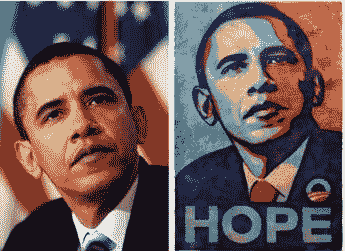

# 美联社再次试图重新定义合理使用；为奥巴马追踪谢泼德·费尔雷海报 TechCrunch

> 原文：<https://web.archive.org/web/https://techcrunch.com/2009/02/05/once-again-the-ap-tries-to-redefine-fair-use-goes-after-shepard-fairey-for-obama-poster/>

# 美联社再次试图重新定义合理使用；为奥巴马海报追踪谢泼德·费尔雷

美联社又在一个关于合理使用 T2 的争论上犯了错误。实际上，它是在追逐艺术家谢泼德·费尔雷标志性的奥巴马海报，它最近发现这张海报是基于曼尼·加西亚的一张美联社照片。海报显然是基于那张照片(见左图对比)，但这正是受版权保护的作品的使用方式。

海报是艺术。它所基于的形象已经发生了足够的变化，甚至美联社直到几周前才知道它拥有潜在作品的版权。Fairey 说他没有从海报中赚到钱，尽管其他人赚了。你可以在海报、贴纸、咖啡杯和 t 恤上买到这个图像，由费尔雷签名的海报副本售价高达数千美元。尽管如此，美联社还是想从费尔雷那里得到钱。

我会链接到美联社描述这一争端的报道，除了我们已经禁止了美联社的这种行为。美联社在侵犯版权方面有着突破法律界限的历史。去年，它对抄袭其标题的网站进行了追踪，即使这些网站有美联社报道的链接。(美联社将其标题辛迪加给新闻机构，这就是它赚钱的方式，但使用标题作为链接也是网络上的常见做法)。

合理使用受到攻击，美联社带头发起攻击。像 Fairey 这样的艺术家总是拿着有版权的图片重新诠释它们。许多人认为这就是艺术。Fairey 的奥巴马海报对我们的文化产生了比原始图片更大的影响，据报道，他是通过谷歌图片搜索找到的。他由斯坦福公平使用项目代理。

我希望他告诉他们去死吧，因为如果这不是合理使用，我不知道什么是。

**更新**:这下更惨了。甚至不清楚美联社是否拥有这张照片的版权。摄影师 Mannie Garcie 说，他拍这张照片时只是一名临时工，从未在美联社的合同上签字。在&与[图片新闻论坛](https://web.archive.org/web/20220930233605/http://photobusinessforum.blogspot.com/2009/02/10-questions-for-mannie-garcia.html)的问答中，他对美联社的所有权声明提出质疑:

> 2)当你拍摄这张照片时，你是美联社的雇员还是自由摄影师，正如他们的合同所定义的那样？
> 
> 我是临时雇员，代替美联社的一名职员。我的理解是，我既不是自由职业者，也不是职员，而是一个临时雇员。我从来没有做过 AP 职员，也没有，我从来没有签过 AP 合同。
> 
> 3)那么，你拥有该图像的版权？
> 
> 据美联社报道，版权的归属存在争议。我的理解是，因为我不是职员，不是自由职业者，也没有签署任何合同，所以我是版权所有者，但我正在与美联社讨论这个问题。