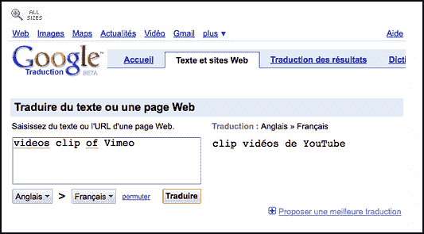

# 谷歌需要法语课；将“Vimeo”翻译成“YouTube”

> 原文：<https://web.archive.org/web/https://techcrunch.com/2009/02/18/google-needs-french-lessons-translates-vimeo-to-youtube/>

# 谷歌需要法语课；将“Vimeo”翻译成“YouTube”

用法语怎么说 [Vimeo](https://web.archive.org/web/20221207210938/http://www.vimeo.com/) ？谷歌翻译认为它的发音是“YouTube”。当提示将英语翻译成法语时，它[正在将](https://web.archive.org/web/20221207210938/http://translate.google.com/translate_t?hl=en#en%7Cfr%7Cvideos%20on%20YouTube%0A)的英语句子“Vimeo 上的视频”翻译成“YouTube 上的视频”。当你试图单独翻译 Vimeo(不是在一个句子中)，法语翻译的结果是“Vimeo”但是在一句话里，谷歌把 Vimeo 翻译成了“YouTube”。

这是一个小故障还是一个法国谷歌工程师隐藏的复活节彩蛋，作为一个内部笑话？该故障仅在从英语翻译成法语时出现。它可以很好地翻译成其他语言。