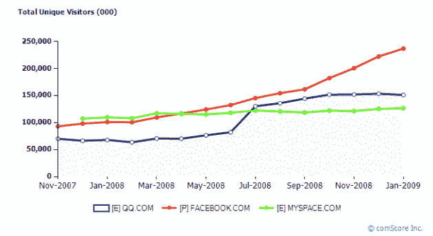
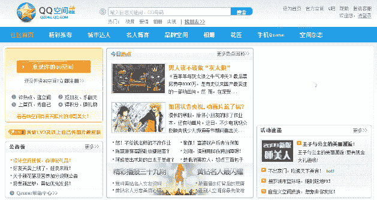

# 中国的社交网络 QZone 很大，但真的是最大的吗？TechCrunch

> 原文：<https://web.archive.org/web/https://techcrunch.com/2009/02/24/chinas-social-network-qzone-is-big-but-is-it-really-the-biggest/>

# 中国的社交网络 QZone 很大，但真的是最大的吗？

中国最大的互联网门户网站腾讯因其广受欢迎的即时通讯产品 [QQ](https://web.archive.org/web/20230214062910/http://en.wikipedia.org/wiki/Tencent_QQ) 而广为人知，上周发布了一份关于其社交网络服务 [QZone](https://web.archive.org/web/20230214062910/http://qzone.qq.com/) 用户数量的最新报告。这份报告只有中文版本，但是亚洲网站的工作人员很乐意翻译它。

如果自我报告的数字不是太夸张的话，它们简直令人震惊。

即便是半信半疑，腾讯提供的数据也值得一提:报告称，截至 2009 年 1 月 31 日，QZone 的用户超过了 2 亿，超过了脸书(最近宣布有 1.75 亿注册用户)和 MySpace 等国际玩家。

为了便于比较，我们看了一下上述社交网络服务的全球 comScore 统计数据，但它们只给出了 QQ.com 的访客数量概况，而没有单独给出 QZone 的访客数量(QZone 有自己的子域)。坦率地说，我们甚至不知道这种比较是否可行，因为我们不确定 QQ 通讯(IM)服务的终点和 QZone 社交网络的起点。

回到腾讯的报告，该报告指出，在 Qzone 的 2 亿用户中，约有 1.5 亿人通过发布博客、分享照片和与其他用户互动来积极贡献自己的力量。在 Qzone，大约有 400 万用户每天平均上传 6000 万张照片。此外，据报道，在 2 月 9 日，该公司的即时通讯工具 QQ 记录了超过 5000 万的并发用户。

这些数字如此令人印象深刻，以至于我们挖得更深一点，偶然发现了一份关于数据中心知识的报告，该报告也怀疑 QZone 在全球范围内是否比脸书更大。这篇文章提到 [Netcraft 的最新月度网络服务器调查](https://web.archive.org/web/20230214062910/http://news.netcraft.com/archives/2009/02/18/february_2009_web_server_survey.html)，这个月开始包括 Qzone 博客服务。Netcraft:“本月的入选使该公司立即成为调查中**最大的博客网站提供商**，超过了 Windows Live Spaces、Blogger 和 MySpace 等公司。”脸书在这里没有被充分报道，因为 Netcraft 的调查没有捕捉到社交网络的所有活动，而是放大了网站而不是用户。

此外，除了 QZone 之外，QQ 还有更多针对各种市场的社交网络服务。QQ 小优是一项针对大学和高中学生的服务，拥有超过 2000 万注册用户，2009 年 1 月才正式推出(自 2008 年 6 月以来一直处于私人测试模式)。

即使 QQ 还没有运营世界上最大的社交网站，它也将很快运营。

