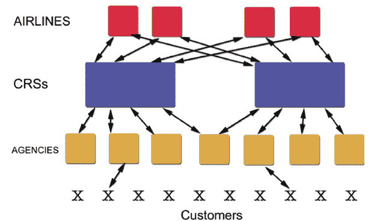
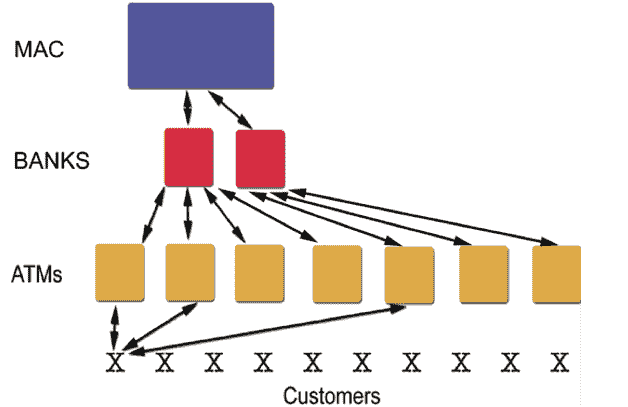
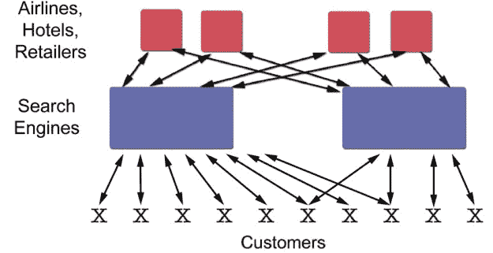

# 针对谷歌的反垄断案件可能会是什么样子

> 原文：<https://web.archive.org/web/https://techcrunch.com/2009/03/01/what-an-antitrust-case-against-google-might-look-like/>

***编者按**:以下是宾夕法尼亚大学沃顿商学院运营与信息管理教授[埃里克·克莱蒙斯](https://web.archive.org/web/20230320210937/http://www.wharton.upenn.edu/faculty/clemons.html)的客座博文。他表达的观点是他自己的，我们在这里提出这些观点是为了促进辩论。*

* * *

主流媒体，如《纽约时报》已经注意到，甚至谷歌自己也开始担心司法部可能会寻求监管，甚至可能是谷歌的拆分。怎么会这样呢？一家公司如何能被视为创造性资本主义的胜利和对经济的良性贡献(“不要作恶！”)可能被怀疑什么？这种监管疏忽疯了吗？不完全是。

下面，我总结了我所知道的谷歌的行为，以及我认为如果司法部试图对谷歌采取行动，司法部可能会察觉到并可能需要证明的事情。在以后的文章中，我会扩展，包括我相信但还不能证明的东西。重要的是要记住，我不是一名律师，只是一所主要商学院的计算机科学教员，有一些诉讼经验，我没有与谷歌或司法部就这些问题进行过对话，但我相信以下内容为司法部的思考提供了一些见解。

*   尽管在赞助搜索市场上出现了来自雅虎和微软等其他搜索引擎的竞争，但谷歌对参与其关键词拍卖的公司享有垄断权。当谷歌与酒店和航空公司等运营成本基本固定的公司打交道时，这种垄断力量尤其强大。
*   谷歌滥用其垄断地位，通过向企业收取过高的费用来接近消费者。这些费用被转嫁到消费者身上，最终对消费者造成伤害。
*   同样，谷歌也在滥用其垄断地位，阻止有利于消费者的领域的市场进入，损害潜在的进入者。
    上述任何一种情况都有理由进行监管干预。第二种，可能还有第三种，也证明了向那些能够证明自己受到谷歌损害的人提供某种形式的经济补偿是合理的。

电子分销渠道中的垄断力量往往难以评估，因为市场份额和市场力量之间的关系可能是欺骗性的，甚至是违反直觉的。我早期研究的两个历史例子提供了开始分析的最佳方式，因为它们的经济含义现在已经非常清楚了。

20 世纪 80 年代中期，美国航空公司的 Sabre 和联合航空公司的 Apollo 计算机化预订系统(CRSs)统治了旅行社预订系统市场，分别占有 43%和 27%的市场份额。其他系统也存在，其他航空公司似乎可以自由地使用他们自己的 CRS 产品，但是代理机构对他们使用的系统很满意，最大的代理机构实际上可以免费使用他们的系统，甚至付费使用，这两家 CRS 供应商的地位似乎很稳定。当时，80%的航空旅行预订是通过旅行社完成的。因此，虽然 Sabre 和 Apollo 都没有占据任何航空公司的大部分预订，但即使是这两家中较小的一家也控制了每家航空公司约 20%的潜在客户，因此也控制了每家航空公司约 20%的销售额。航空公司最初选择早期参与，当时参与 CRSs 是免费的。只是到了后来，当旅行社开始依赖 CRS 时，也就是当航空公司也开始依赖 CRS 时，Sabre 和 Apollo 才开始对他们提供给航空公司的预订、票务和其他服务收取高额费用。

我们能证明这些 CRS 当时有市场支配力吗？历史记录清楚地表明了这一点。当阿波罗将 Frontier 从其预订系统中退出时，Frontier 被迫根据破产法第 11 章申请破产保护；它重新出现，重新在阿波罗上市，并继续飞行。当比阿波罗更大的 Sabre 放弃 Braniff 时，Braniff 以清算告终，不再运营。显然，市场力量是存在的，而且这种力量对所有航空公司来说都是显而易见的，即使乘客甚至代理机构都没有意识到这一点。最终，美国航空公司和联合航空公司从预订其他航空公司的航班上获得的收入都超过了他们自己的运营收入，并且一度美国航空公司从预订达美航空公司的航班上获得的收入超过了达美航空公司运营这些航班获得的收入。

Sabre 和 Apollo 都没有垄断预订服务市场，但它们都通过代理客户垄断了市场份额。从下图中可以清楚地看出这一点。

几乎与此同时，费城国家银行(PNB)获得了现金流，与 Provident 签约成为客户银行，并巩固了 MAC 作为费城地区唯一 ATM 服务提供商的地位。有趣的是，即使拥有 100%的银行间 ATM 交换服务市场，PNB 也缺乏垄断力量，无法向其成员银行收取过高的费用，也从未对费城的其他银行构成竞争威胁。我们怎么可能解释这个？还是那句话，一张图片很有帮助。

从这些图片中，我们可以清楚地看到这两个网络的几何结构——CRS 服务和 ATM 服务——非常不同。CRS 位于航空公司和乘客之间。如果一个 CRS 放弃了一家航空公司，那么所有使用 CRS 的代理和该代理的所有客户都被拒绝访问一家(且仅一家)航空公司。代理商可能不在乎，客户可能甚至不知道。此外，在搜索引擎和在线预订出现之前，绕过 CRS 意味着只要拒绝加入 CRS，失去的业务就可能无法挽回。尽管费用高昂，但没有一家航空公司自愿退出 CRS。

相比之下，每家银行都位于其客户和 ATM 网络服务提供商 MAC 之间。如果一家银行被拒绝接入网络，至少它自己的卡可以在自己的机器上使用。此外，每家银行在与 MAC 通信时都使用相同的界面。因此，这些银行能够结成联盟——如果 PNB 试图与他们中的任何一家进行不公平竞争，他们只需在他们之间实施双边交换，并将 MAC 完全排除在外。

同样，即使拥有 100%的市场份额，也没有针对 MAC 的滥用投诉。相比之下，针对中央应急系统运营商的投诉数量很大，最终，司法部的规定严重限制了中央应急系统运营商的权力。
对于搜索，我们可以从当前网络的几何结构中学到什么？

显然，谷歌在赞助搜索和搜索领域的市场份额普遍高于 Sabre 或 Apollo，而且很明显，谷歌介于购物者和最终服务提供商(酒店、航空公司、零售商或制造商)之间，就像我们在航空公司 CRSs 的案例中看到的那样。谷歌在服务提供商面前享有巨大的市场支配力的条件是正确的，服务提供商认为他们必须在谷歌赞助的搜索关键词拍卖中竞标。

抵消谷歌在搜索领域的市场份额优势大于 Sabre 或 Apollo 的最大优势的事实是，存在通往航空公司、酒店和零售商的替代路线。例如，在酒店的情况下，顾客可以直接打电话给酒店，或者可以打电话给连锁酒店的中央预订系统，或者可以输入酒店自己的预订网站的 URL，或者可以输入连锁酒店的中央预订网站的 URL。相关市场份额的概念是微软反垄断诉讼的关键部分，在评估谷歌搜索对公司接触客户的重要性时，它可能也是一个关键因素。

司法部还需要展示什么？它想要展示经济学家威廉·鲍莫尔所说的“T2”不存在，这通常被认为是可以获得市场支配力的迹象，它想要展示市场支配力的滥用。(有趣的是，鲍莫尔在为& T 公司做顾问时发展了可竞争理论，他发展这一理论是为了论证在有些情况下，即使是 100%的市场份额也不构成垄断力量。相比之下，我们在这里论证，即使没有垄断市场份额，市场势力也可能存在)。他对是否存在竞争的测试是在一个行业赚取足够的钱来补贴其他行业的能力。检验滥用市场支配力的标准是过高的价格和利用这些补贴来阻止竞争者的进入。在微软的试验中，这两者是同时建立的，这里也可以这样做:

*   谷歌从赞助搜索中获得的收入足以补贴几乎所有其他业务，包括 gmail、谷歌 Office、Latitude、gDrive 等。
*   谷歌确实在补贴这些其他企业，阻止它们进入，并最终允许它们以后收取垄断价格。

司法部还想证明什么？

*   只要谷歌免费向消费者提供服务，消费者就没有理由转换搜索引擎。严格来说，这是不正确的；更准确地说，只要大多数搜索的自然有机搜索和与购买决策相关的搜索的赞助付费搜索的组合是有效的，那么消费者就没有理由转换搜索引擎。司法部可能想要评估有机搜索和付费搜索的质量，以确定消费者为什么满意。
*   只要谷歌拥有其目前在赞助搜索领域享有的市场份额，就没有哪家服务提供商敢冒险拒绝参与关键词拍卖，尤其是那些属于其商标一部分、最有可能被搜索关键词的消费者使用的关键词。其他市场份额有限的搜索引擎的出现并没有改变谷歌对企业的影响力，因为有大量的消费者确实在使用谷歌。美国司法部可能希望评估企业被过度收费的程度，以及这些收费在多大程度上导致消费者的商品和服务价格上涨。

请注意，谷歌拥有垄断权力并滥用这种权力的论点，并不需要证明谷歌的搜索是优或劣的。这并不需要证明谷歌可以在有机搜索方面做得更好，甚至不需要证明它故意不在有机搜索方面做得更好。如果低质量的有机搜索确实存在，它不需要证明消费者直接受到低质量的有机搜索的伤害。这当然不需要证明谷歌是非法获得市场份额的。它只需要证明谷歌在一个不可竞争的市场中拥有垄断力量，并且滥用这种力量向企业收取过高的费用，阻止其他企业进入市场。同样，它也不要求证明谷歌付费搜索是旅游业遭受的唯一过度收费，并转嫁给了消费者；最离谱的是，hotels.com 收取 30%的佣金，同时声称成本很低。

我相信司法部将能够确立垄断权力和对这种权力的滥用。最终，司法部将寻求证明赞助搜索的高收费对消费者造成的直接或间接损害，并且最终，我相信司法部将成功地证明这一点，但这些对于证明市场支配力的存在和滥用并不重要。

再次声明，我不会像律师那样处理此事，也没有与任何相关方的律师讨论过此事，但我希望司法部和谷歌总部的律师已经在解决这些问题。