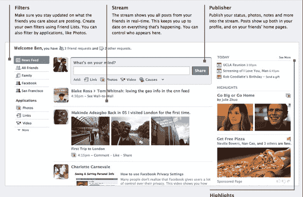
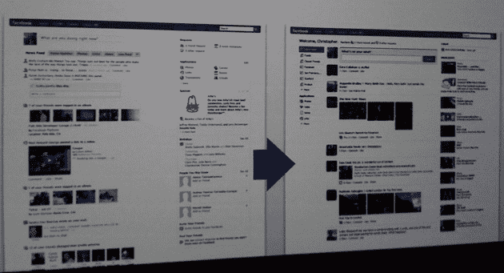
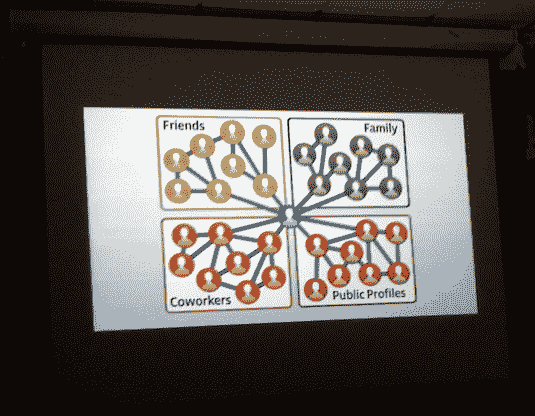
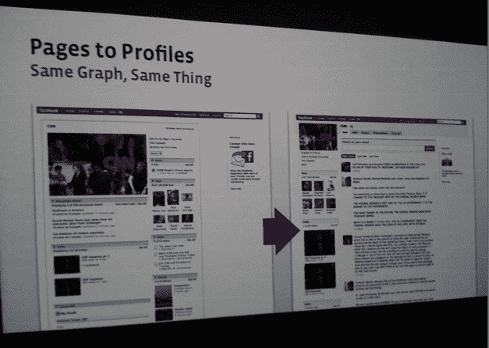

# 脸书对 Twitter | TechCrunch 的回应

> 原文：<https://web.archive.org/web/https://techcrunch.com/2009/03/04/facebooks-response-to-twitter/>

脸书今天宣布了一些关于主页、个人资料页面和活动流的变化。综上所述，这些代表了对 Twitter 崛起的一致回应，Twitter 是一个实时信息广播系统，超越了成员的个人朋友圈。

最大的变化之一是，脸书正在摆脱私人资料和公共页面之间的区别。5000 个好友的限制将从公共页面中取消。脸书不希望 Twitter 成为大公司和公众人物联系粉丝的方式。到目前为止，脸书页面还不是粉丝们联系他们喜爱的名人或品牌的地方。为此，他们已经开始上 Twitter，在那里他们可以获得实时更新。

脸书也在加速更新每个人个人页面上的新闻。以前，这些大约每 10 分钟更新一次。脸书引入的实时更新和单边关注系统模仿了 Twitter 的功能。虽然对游戏的这一部分来说可能有点晚，但它的 1.75 亿用户群让 Twitter 相形见绌。首席执行官马克·扎克伯格解释道:

> 我们今天所谈论的，是一种哲学上的改变，因为我们想把这些公众人物(单向的)和朋友(双向的联系)融合在一起。

在整个[新闻发布会上](https://web.archive.org/web/20230313100915/https://techcrunch.com/2009/03/04/liveblogging-facebooks-open-door-press-conference/)，脸书强调了活动流和社交图(成员之间的社交关系图)的重要性。脸书的产品开发总监克里斯·考克斯是这样说的:

> 溪流就是正在发生的事情。我们认为它和图表一样重要。图表是连接，流是正在发生的事情。

这些变化将在主页上成为显著的焦点。扎克伯格说:

> 有了新的主页，这将反映更快的信息流动。

重新设计的主页将允许用户更容易的分类和过滤他们的信息。更新可以通过群组、特定的朋友、家人或应用程序进行过滤。一个新的共享更新的发布框不仅可以添加状态注释，还可以添加链接、照片和视频。一个新的小工具将突出显示来自朋友和其他成员互动最多的关系的项目。通过这种方式，脸书正试图在它作为一个私人通信系统的传统优势和越来越多的公共连接服务之间取得平衡。

从表面上看，这些似乎是进化上的变化，但风险很高。脸书正试图将自己支撑为一个活跃、快速发展的网络的基础，在这个网络中，私人信息和公共内容之间的界限是模糊的。在任何情况下，它都不想把用户的[思想流](https://web.archive.org/web/20230313100915/https://techcrunch.com/2009/02/15/mining-the-thought-stream/)拱手让给 Twitter。而不是问“你现在在做什么？”，新的状态更新框会问:“你在想什么？”混合在脸书连接，这些思想流可以从网络上收集。

尽管脸书的规模已经相当大，但它正展示出应对新威胁的娴熟技巧。如果脸书[不能收购 Twitter](https://web.archive.org/web/20230313100915/https://techcrunch.com/2008/11/24/acquisition-dance-between-facebook-and-twitter-over-for-now/) ，它将试图击败它。

