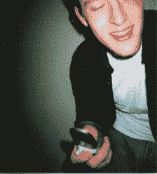

# iPhone 在醉酒拨号大战中获得新武器 TechCrunch

> 原文：<https://web.archive.org/web/http://techcrunch.com/2009/03/19/the-iphone-gets-a-new-weapon-in-the-war-on-drunk-dials/>

# iPhone 在醉酒拨号的战争中获得了一个新的武器

手机的普及使得沟通比以往任何时候都更容易，人们可以通过打电话和发短信的方式随心所欲地联系朋友和家人。不幸的是，我们中的许多人在各种醉酒状态下变得特别有动力使用这些能力，经常导致给以前的恋人、同事和我们五年没有说过话的人发出不连贯或潜在的冒犯信息。在过去的几个月里，我们已经看到了许多防止这种现象的[方法](https://web.archive.org/web/20230203010251/http://techcrunch.com/2008/10/07/april-fools-check-did-google-really-release-mail-goggles/)，这种现象被广泛称为“醉酒拨号”，今天我们看到了一些新的 iPhone 应用程序的推出，这些应用程序很可能正是我们一直在寻找的。

这两个应用程序，被称为'[坏决策拦截器](https://web.archive.org/web/20230203010251/http://itunes.apple.com/WebObjects/MZStore.woa/wa/viewSoftware?id=305235458&mt=8)和'[不拨号！](https://web.archive.org/web/20230203010251/http://itunes.apple.com/WebObjects/MZStore.woa/wa/viewSoftware?id=296499842&mt=8)’，阻止用户在设定的时间内(从几小时到几天)呼叫指定的联系人。通过在晚上外出前禁止某些“麻烦”联系人，用户可以潜在地避免任何尴尬的电话或短信。

我测试了坏决定拦截器，不要拨！似乎都是一样的。在选择了你想要禁止的联系人后，应用程序会询问你想在多长时间内不给他们打电话。一旦你确定了时间段，应用程序会覆盖你的 iPhone 地址簿中的数据，这样就不可能恢复，直到你在分配的时间过后重新启动坏决策拦截器。据我所知，没有任何简单的方法可以绕过屏蔽(即使删除应用程序也不起作用)——鉴于一些喝醉的用户无疑会竭尽全力试图恢复电话号码，这是一种必要。

“不拨号”增加的一个功能是可以指定一个朋友作为你手机的监护人——只有在他们在手机中输入预定的密码后(大概是在你清醒后),你才能再次给你被阻止的联系人打电话。这当然是假设你信任你的朋友。

对于那些希望将醉酒拨号提升到一个新水平的读者来说，有 [Dudler](https://web.archive.org/web/20230203010251/http://itunes.apple.com/WebObjects/MZStore.woa/wa/viewSoftware?id=306011386&mt=8) ，它允许你摇动手机给随机联系人打电话(你可以选择总是忽略几个联系人，比如你的母亲，但这难道不有趣吗？)