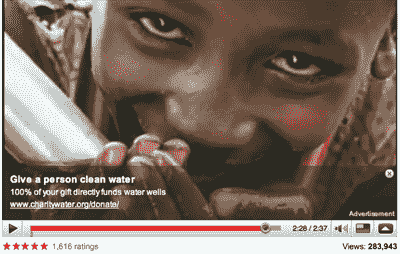

# YouTube 上的特殊广告一天就能让非营利组织赚到 10，000 美元

> 原文：<https://web.archive.org/web/https://techcrunch.com/2009/03/27/special-youtube-ads-earn-nonprofit-10000-in-a-single-day/>

# YouTube 上的特殊广告一天就能为非营利组织赚到 1 万美元

本周早些时候，YouTube 为非营利组织推出了一个名为“行动呼吁”的新功能，允许这些组织免费在他们的视频上放置特殊的叠加广告。这些覆盖图可以引导浏览者到非营利组织的主页，在那里用户可以选择捐款，注册邮件列表，并与社区中的其他成员互动。与 YouTube 上的典型广告(视频上传者通常无法控制)不同，非营利组织可以准确指定他们想要重定向到哪个页面。

为了测试这一功能，YouTube 上周日在其主页上放置了一个支持慈善机构[水](https://web.archive.org/web/20230313211822/http://www.charitywater.org/donate/)的[视频，其中有一个鼓励 YouTube 用户为该事业捐款的覆盖图。在那一天，慈善:水](https://web.archive.org/web/20230313211822/http://www.youtube.com/watch?v=DEnlrE4iMBU)[从 YouTube 观众那里获得了高达 10，000 美元的收入。诚然，视频出现在主页上的事实显然对投票率产生了巨大影响，但新的行动号召广告的成功可能会给许多非营利组织带来好处。](https://web.archive.org/web/20230313211822/http://www.youtube.com/blog?entry=LD50xTsUNaw)

同样值得注意的是，这是 YouTube 转向允许主要 YouTube 合作伙伴在他们自己的内容上放置自己的广告的又一步(在此之前，广告通常是由 YouTube 销售和提供的)。一月份，我们[报道了](https://web.archive.org/web/20230313211822/https://techcrunch.com/2009/01/21/exclusive-youtube-will-soon-let-big-content-partners-bring-their-own-ads/)YouTube 正在悄悄地向主要内容合作伙伴推出这一功能，如果 YouTube 将这一强大的功能扩展到品牌和慈善机构之外，开始包括名人和政治家，这并不奇怪。

