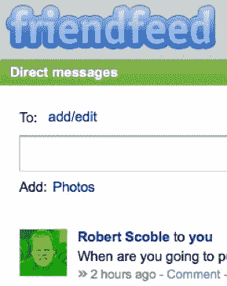
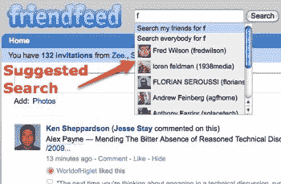

# 新的 FriendFeed:更简单、更快、更好(也许太快了)

> 原文：<https://web.archive.org/web/https://techcrunch.com/2009/04/06/new-friendfeed-simpler-faster-better-maybe-too-fast/>

FriendFeed 的联合创始人保罗·布切特最近被问及[成为脸书](https://web.archive.org/web/20221230090241/http://techcrunch.com/2009/02/09/facebook-activates-like-button-friendfeed-tires-of-sincere-flattery/)的研发部门是什么感觉。他的回应相当谦虚，但你不禁会想，脸书、Twitter 和 FriendFeed 要多久才会开始变得非常相似，因为这些服务只是简单地从竞争对手那里复制最好的功能。

不过，有一点是肯定的:FriendFeed 发展最快。他们第一个给状态更新添加评论，第一个[引入第三方反馈](https://web.archive.org/web/20221230090241/http://techcrunch.com/2008/02/22/facebook-targets-feedfriend/)，第一个[意识到搜索的价值](https://web.archive.org/web/20221230090241/http://techcrunch.com/2008/03/17/friendfeed-has-search-and-suddenly-looks-like-a-destination-site/)。他们还在其他人之前尝试了实时流。他们首先做的很多事情都被其他人复制了——甚至谷歌也陷入了困境。

现在，FriendFeed 正在进行彻底的重新设计和大量新功能的下一步发展。我们上周看到了新网站的演示，并在周末对其进行了测试。我们的观点是:新的 FriendFeed 比旧的 FriendFeed 更简单、更快、更好。其实可能有点太快了。

你首先会注意到的是网站的新面貌。左边栏不见了，关键信息在右边单独的区域。该页面的主要部分现在只显示消息。它实际上看起来很像 Twitter。

最引人注目的新功能是实时流。去年的实验已经被推广到了网站的每一个角落。

FriendFeed 的联合创始人 [Bret Taylor](https://web.archive.org/web/20221230090241/http://www.crunchbase.com/person/bret-taylor) 表示，通过增加这一功能，FriendFeed 可以作为一个类似 Gmail 的聊天界面在一个或多个朋友之间使用，并希望改变 FriendFeed 作为一种交流工具的使用方式。实时更新你的朋友和联系人的状态确实很酷，但是看着页面不断更新会有点烦人。

当实时信息进入你的信息流时，它会把你正在阅读的内容推得更低，这也有点烦人。FriendFeed 对此有一个解决方案:一个暂停按钮，你可以关闭实时更新，当关闭时，图标会告诉你有多少实时更新正在等待添加到你的流中。新的界面还允许你直接向朋友发送信息和照片，并让你将这些信息发布到 Twitter 上。

界面的另一个重大变化是服务图标(出现在消息旁边的图像)已经从信息源(Twitter、RSS、Flickr 等)改变了。)到创建消息的人的个人资料图片。这使得浏览邮件寻找有趣的内容变得更加容易。

FriendFeed 增加了许多功能来促进用户之间的互动，包括分享功能，你可以分享对话、直接信息、Feed、链接等。给你的任何一个朋友或一个朋友。搜索过滤器变得更加强大，允许你通过关键词或名字过滤搜索，或者将搜索限制在特定的朋友群或所有的 FriendFeed 上。搜索框会给你朋友档案的建议，帮助你轻松导航到朋友的订阅源。FriendFeed 还让你能够在朋友之间创建一个私人“聊天室”，称为“FriendFeed 反馈”与群组页面类似，私人房间功能允许您创建一个订阅源，该订阅源仅限于多个用户使用，可以标记为公共或私人，并且可以用作一种通信工具，以便在类似论坛的环境中进行聊天。

这些变化都是该服务新测试版的一部分，用户可以选择从今天开始使用。FriendFeed 表示，他们推出了测试版界面，因为他们希望在收到用户反馈时对界面进行调整，并计划在收到评论后一起改变界面。FriendFeed 已经改变了界面并增加了新功能，今年早些时候增加了[高级搜索功能](https://web.archive.org/web/20221230090241/http://techcrunch.com/2009/02/03/friendfeed-cuts-through-the-noise-with-advanced-search-features/)，并在去年秋天的总统竞选期间创建了一个简洁的[实时博客工具](https://web.archive.org/web/20221230090241/http://techcrunch.com/2008/10/15/friendfeed-built-the-ultimate-live-blogging-tool/)。

这是我们上周看到的演示的一个简短版本。罗伯特·斯科博也有一个更长的高清版本。