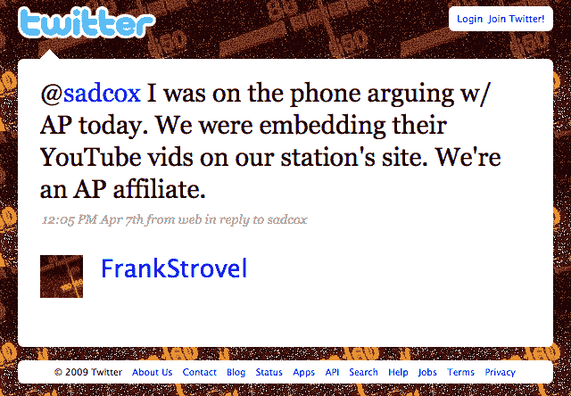
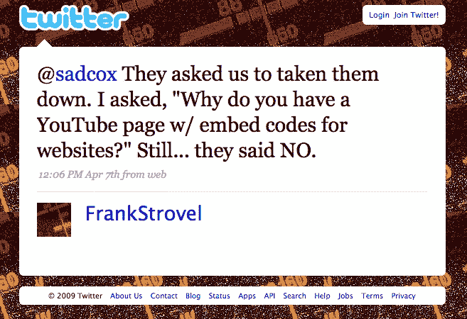

# A.P. Exec 不知道它有 YouTube 频道:威胁加盟店嵌入视频技术危机

> 原文：<https://web.archive.org/web/https://techcrunch.com/2009/04/08/ap-exec-doesnt-know-it-has-a-youtube-channel-threatens-affiliate-for-embedding-videos/>

这是人工授精历史上的又一个伟大时刻。为了成为报纸行业的 RIAA(T2 ),美联社的高管和律师们开始在无知方面与音乐行业的同行竞争。田纳西州的一家乡村广播电台，WTNQ-FM ，收到了一位美联社下属关系副总裁的一封警告信~~，因为他在其网站上发布了来自该报官方 Youtube 频道的视频。*见下文**更新**。*~~

你不能编造这些东西。暂时忘记 WTNQ 本身是 A.P .的附属机构，A.P .不应该骚扰它自己的成员。显然，没有人告诉美联社的高管，这家庄严的新闻机构甚至有一个由美联社自己控制的 YouTube 频道，而且美联社的某个人认为打开视频嵌入功能可能是一个好主意，这样它的视频就可以和视频中的广告一起在网络上虚拟传播。

弗兰克·斯特罗维尔是一名电台员工，他试图对美联社的高管说些有意义的话，昨天他发推特说:

*我今天在电话里和美联社争论。我们把他们的 YouTube 视频嵌入了我们电视台的网站。我们是美联社的附属机构。*

然后[增加](https://web.archive.org/web/20230131233437/http://twitter.com/FrankStrovel/status/1471367126):

*他们让我们把它们拿下来。我问，“为什么你有一个嵌入网站代码的 YouTube 页面？”尽管如此……他们还是拒绝了*

这个故事是由《T21 时报》和当地视频制作人克里斯蒂安·格兰瑟姆拍摄的，他在下面的视频中捕捉到了斯特罗维尔在 Skype 上的采访(这不是一段即时通讯视频，所以我将把它嵌入其中)。斯特罗维尔指出，美联社指责该电台“窃取了他们的授权内容”。他听起来很困惑，这是他应该做的。面试中反复出现的这种情况说明了一切:

**   **Strovel**: And we’re an A.P. affiliate for crying out loud! I stumped him on that one. . . . What is really shocking is that they were shocked that they’ve got a YouTube channel that people are embedding on their Websites. He seemed shocked by that. ‘Oh, I am going to have to look into that” is what he told me.

    **格兰瑟姆**:真是个白痴！

    **斯特罗维尔**:我知道，我知道。

斯特罗维尔不得不从他的网站上删除所有的视频。

**更新**:看起来 A.P .正在[后退](https://web.archive.org/web/20230131233437/http://twitter.com/FrankStrovel/status/1484734786)并将允许视频再次上升。美联社还给我发了一份声明，说从未起草过停战信。严格来说，不是。这位 A.P .高管在[电子邮件](https://web.archive.org/web/20230131233437/http://leftofdial.com/?p=1016)中发出警告，其效果与正式信件相同。“这是一个误解，已经迅速发展成完全不同的东西，”美联社的发言人告诉我。以下是完整的官方声明:

*美联社就美联社更广泛的在线视频服务联系田纳西州广播电台时，对 YouTube 的使用存在误解。美联社在任何时候都没有起草或向电视台发送停止信。美联社试图为该电台提供满足他们需要的优质服务。*

换句话说，在威胁电台的同时，它试图说服电台使用其“更广泛的在线视频服务” [OVN](https://web.archive.org/web/20230131233437/http://www.ap.org/OVN/promotoolssupport.html) ，而电台真正需要的是美联社已经在 YouTube 上提供的服务。美联社继续让我吃惊。它成功地朝自己的同一只脚开了两枪。

[YouTube http://www.youtube.com/watch?v=E9YLkcJsoGk&hl=en&fs=1]

*