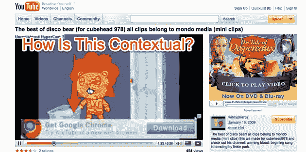

# YouTube 悄然推出 AdSense 视频广告，宣称内容拥有版权 TechCrunch

> 原文：<https://web.archive.org/web/https://techcrunch.com/2009/04/08/youtube-quietly-rolls-out-adsense-for-video-to-claimed-copyrighted-content/>

# YouTube 悄悄地为声称拥有版权的内容推出视频广告

Youtube 正竭尽全力将网站上专业制作的内容转化为一大收入来源。通过其内容 ID 计划，它对 600 个内容合作伙伴的视频库进行数字指纹识别，并为这些媒体公司和视频创作者提供针对任何包含其版权材料的视频投放广告的选项。他们也可以选择自动删除这些视频，但超过 90%的人选择额外的广告收入。

到目前为止，这些广告只是普通的横幅广告和弹出广告。但是从今天开始，YouTube 开始在宣称的内容上推出视频广告的 [AdSense。AdSense for Video 广告根据上下文定位到视频的标题、文本和标签，或者可以根据类型更广泛地定位。例如，这个用户上传的视频显示了 Disco Bear](https://web.archive.org/web/20221006210748/http://www.beta.techcrunch.com/2008/02/21/adsense-for-video-comes-out-of-private-beta-can-we-kill-the-pre-roll-now/) 的[卡通剪辑，被识别为属于](https://web.archive.org/web/20221006210748/http://www.youtube.com/watch?v=fKm3zaGBBG4) [Mondo Media](https://web.archive.org/web/20221006210748/http://www.youtube.com/user/mondomedia?blend=1&ob=4) 的内容，而我在边上看到的广告对于动画电影 *The Tale of Despereaux* 来说是足够恰当的。不幸的是，这不是视频广告的 AdSense。AdSense 广告是在视频播放过程中在播放器底部弹出的叠加广告。我现在得到的只是谷歌 Chrome 浏览器的填充广告(见上面的截图)。

但 YouTube 向我保证，随着该计划今天推出，这些将变得更加相关。再举一个例子，当我看这个关于清洁窗户的家庭装修视频时，一个 AdSense 文本广告有时会出现在底部。这个视频不是声称的内容，但它显示了 AdSense for Video 如何能够比运行网站的横幅广告提供更合适的广告。你也可以得到奇怪的并列或糟糕的匹配(见上文)。不过，总的来说，我已经能够确认 AdSense 上视频广告的点击率高于普通横幅广告。而且，总的来说，内容 ID 合作伙伴为他们的视频创造的浏览量(因此，广告展示量)是他们仅仅依靠自己的视频上传和 YouTube 频道的两倍。

这只是 YouTube 试图摆脱其在谷歌内部的成本中心地位的一个例子。YouTube 的其他努力包括[点击购买链接](https://web.archive.org/web/20221006210748/http://www.beta.techcrunch.com/2008/10/07/still-searching-for-a-video-business-model-google-introduces-the-youtubevertorial/)、[付费下载](https://web.archive.org/web/20221006210748/http://www.beta.techcrunch.com/2009/02/12/youtube-hopes-to-boost-revenue-with-video-downloads/)和[付费搜索结果](https://web.archive.org/web/20221006210748/http://www.beta.techcrunch.com/2008/11/12/more-sex-videos-for-everyone-youtube-sells-video-search-results-to-the-highest-bidder/)。但是，从网站上专业制作的(日益增长的)内容中榨取金钱似乎是一个特别富有成效的领域。例如，在过去的几个月里，YouTube 已经允许越来越多的内容合作伙伴在收入分成的基础上出售他们自己的广告库存。自从我上次[写了关于这个](https://web.archive.org/web/20221006210748/http://www.beta.techcrunch.com/2009/01/21/exclusive-youtube-will-soon-let-big-content-partners-bring-their-own-ads/)的文章后，从[迪士尼](https://web.archive.org/web/20221006210748/http://newteevee.com/2009/03/30/report-disney-plays-the-field-talking-with-youtube/)到 [Machinima](https://web.archive.org/web/20221006210748/http://www.youtube.com/user/machinima?blend=1&ob=4) 的合作伙伴都被邀请参加这个特别的自带广告项目。

