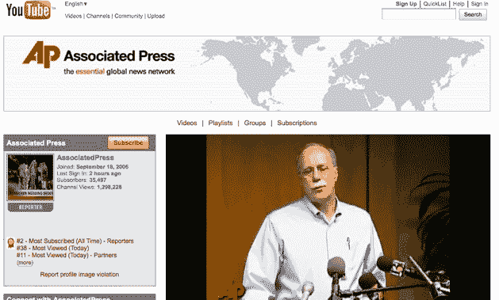

# 美联社道歉，承认“对 YouTube 用法的误解”

> 原文：<https://web.archive.org/web/https://techcrunch.com/2009/04/09/the-ap-apologizes-admits-to-a-misunderstanding-of-youtube-usage/>

# 美联社道歉，承认“对 YouTube 用法的误解”

我昨天[的帖子](https://web.archive.org/web/20221005142714/http://www.beta.techcrunch.com/2009/04/08/ap-exec-doesnt-know-it-has-a-youtube-channel-threatens-affiliate-for-embedding-videos/)关于美联社追踪其一个附属机构在其网站上嵌入美联社自己的 YouTube 频道的视频引起了一点[的骚动](https://web.archive.org/web/20221005142714/http://www.techmeme.com/090408/p90#a090408p90)。正如我在原始帖子的更新中提到的，美联社现在正在[让步](https://web.archive.org/web/20221005142714/http://twitter.com/FrankStrovel/status/1484734786)和[道歉](https://web.archive.org/web/20221005142714/http://www.bnonews.com/news/237.html)。它将允许视频再次上传。

美联社也给我发了一份声明，称从未起草过任何禁止令。技术上来说，不是。一位美联社高管通过一封电子邮件向电台发出了警告，这封电子邮件与正式信件具有同等效力。“这是一个误解，已经迅速发展成完全不同的东西，”美联社的发言人告诉我。这是美联社完整的官方声明:

*当美联社就美联社更广泛的在线视频服务联系田纳西广播电台时，人们对 YouTube 的使用产生了误解。在任何时候，美联社都没有起草或向电视台发送停止信。美联社正努力为电视台提供满足他们需求的优质服务。*

换句话说，在威胁电台的同时，它试图说服电台使用其“更广泛的在线视频服务”(这将是 [OVN](https://web.archive.org/web/20221005142714/http://www.ap.org/OVN/promotoolssupport.html) )，而电台真正需要的是美联社已经在 YouTube 上提供的内容。至少他们道歉了。