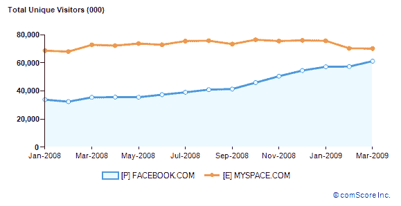

# 缩小差距:脸书仅差 900 万访问者就能超过美国的 MySpace

> 原文：<https://web.archive.org/web/https://techcrunch.com/2009/04/16/closing-the-gap-facebook-only-9-million-visitors-away-from-passing-myspace-in-us/>

# 缩小差距:脸书仅差 900 万访问者就能超过美国的 MySpace

在 TechCrunch 上，我们最喜欢的室内游戏之一是试图猜测脸书将在何时超越 MySpace，成为美国独立访客数量排名第一的社交网络。在世界范围内，脸书在更久以前(2008 年 4 月)摘得桂冠。但在美国，MySpace 更难被取代。

根据 comScore 的数据，去年年底，MySpace 在美国的独立访问者数量上的差距刚刚超过 2000 万。当时，我们[预测了](https://web.archive.org/web/20230404131120/https://techcrunch.com/2009/01/13/social-networking-will-facebook-overtake-myspace-in-the-us-in-2009/)当时两项服务的增长率，并计算出脸书将在 2010 年 1 月之前超过 MySpace。看起来这个估计可能太保守了。如今，脸书已经将这一差距缩小到 910 万独立美国访客，并有望在未来三个月内超过 MySpace。

根据 comScore 3 月份的最新数据，本月美国有 6，120 万人访问了脸书，而 MySpace 为 7，020 万人。脸书本月的游客数量增加了 380 万，增幅为 6.7%。与此同时，MySpace 正在流失访问者。3 月份，它吸引的美国游客比 2 月份少了 16 万，比 1 月份少了 580 万，1 月份有 7600 万美国游客。MySpace 在国际上也日渐式微(基于二月份的数据)。

如果 MySpace 停滞不前或者失去更多动力，脸书在美国赶上它应该没有问题。