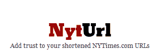

# 现在，就连《纽约时报》也进入了 URL 缩短领域...有点 TechCrunch

> 原文：<https://web.archive.org/web/https://techcrunch.com/2009/04/19/now-even-the-new-york-times-is-entering-the-url-shortening-arena-kinda/>

# 现在，就连《纽约时报》也进入了 URL 缩短领域…有点

今天早些时候，我报道了两个新的网址缩短服务， [UnHub 和 LNK.by](https://web.archive.org/web/20221006035502/http://www.beta.techcrunch.com/2009/04/19/more-ways-to-shorten-those-urls-unhub-and-lnkby/) ，这是众多基本网络应用程序的最新成员，许多人越来越习惯于在微共享服务和社交网站上共享链接。

就在我以为我已经受够了这种服务的时候，我们听到了一个让我惊讶的消息。输入 [NytUrl](https://web.archive.org/web/20221006035502/http://nyturl.com/) ，NYtimes.com 文章的“可信”网址缩写。**更新**:该网站和所有的重定向都因“滥用”而被关闭

据该网站称，这项服务缩短了 NYTimes.com 文章的网址，尽管快速测试表明它绝对不限于其他网站(见[http://nyturl.com/34](https://web.archive.org/web/20221006035502/http://nyturl.com/34)和[http://nyturl.com/35](https://web.archive.org/web/20221006035502/http://nyturl.com/35))，即使它偶尔会说该网址对任何其他网站都无效。这当然违背了该服务的整个目的，即让点击链接的人放心，他们会在 NYTimes.com 网站上结束。我的猜测是，向其他网站添加链接的功能将很快被禁用。

NytUrl 还附带了一个方便的 bookmarklet 和一个基本 API，但该网站声称这仅仅是一个开始，很快会有很多新功能。

奇怪的是:这项服务不是由《纽约时报》运营的，甚至也没有得到它的认可。事实上，官方推特账户 [@NYTimes](https://web.archive.org/web/20221006035502/http://twitter.com/NYTimes) 使用 bit.ly 来链接文章，即使一些与 NYT 相关的账户显然已经在使用 NytUrl.com，正如[这个推特搜索查询](https://web.archive.org/web/20221006035502/http://search.twitter.com/search?q=nyturl)所证明的那样(以及这些[例子](https://web.archive.org/web/20221006035502/http://twitter.com/last_word/status/1559899997) [推文](https://web.archive.org/web/20221006035502/http://twitter.com/timespeople/status/1541727171))。

那么是什么原因呢？在 WHOIS 上搜索 nyturl.com 域名的所有者不会发现任何问题，因为他或她的身份在注册时就受到保护，但根据我们的消息来源，这实际上是两名《纽约时报》员工的工作，即该集团的高级软件架构师之一 [Jacob Harris](https://web.archive.org/web/20221006035502/http://open.blogs.nytimes.com/author/jacob-harris/) 和内部开发人员 [Michael Donohoe](https://web.archive.org/web/20221006035502/http://twitter.com/donohoe) 。

这一点得到了证实，因为哈里斯自称是[的推特粉丝](https://web.archive.org/web/20221006035502/http://twitter.com/harrisj)和《纽约时报》的狂热爱好者，根据 SXSW 网站上发布的[简历(他是其中一次会议的小组成员)，他也是为《纽约时报》的多个相关账户建立推特订阅的人。多诺霍甚至在他的网站上列出了 NytUrl 服务，所以毫无疑问他参与了。](https://web.archive.org/web/20221006035502/http://www.sxsw.com/interactive/talks/panels?action=bio&id=199966)

**更新:** Donohoe 回复了提供更多信息的请求，但拒绝分享更多细节。

如果你想知道为什么哈里斯不使用[nyt.com](https://web.archive.org/web/20221006035502/http://nyt.com/)(由纽约时报所有并转发到主网站)来提供服务，这将从缩短的网址中删除另外 3 个字符:我们的消息来源称这可能是一个草根倡议，尚未得到纽约时报任何决策者的批准，而且不清楚它是否会在未来出现。

这确实提出了有趣的问题:媒体公司获得对它们在网上传播的短网址的控制并链接回它们的内容，这是一个好主意吗？网民会更信任媒体拥有的网址缩写吗？或者他们应该只是利用现有的资源，而不是再增加一个新的资源？

(请注意，我们自己使用 tcrn.ch 作为我们的 Twitter 账户，你可以在评论框旁边看到我们任何帖子的简短 URL，在这里是 http://tcrn.ch/Lk

你对此有何想法？