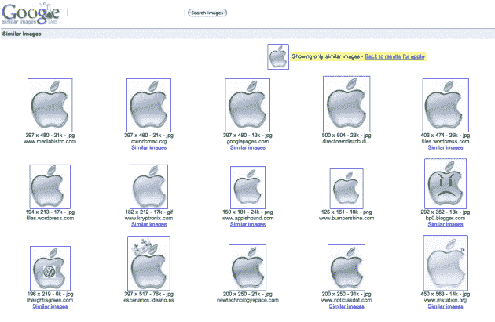

# 谷歌相似图片第一次看 TechCrunch

> 原文：<https://web.archive.org/web/http://techcrunch.com/2009/04/20/google-similar-images-first-look/>

# 谷歌类似图片先看看

一个新的 20%时间谷歌项目刚刚[推出](https://web.archive.org/web/20230204224648/https://techcrunch.com/2009/04/20/live-at-the-google-labs-press-event/)叫做[谷歌相似图片](https://web.archive.org/web/20230204224648/http://similar-images.googlelabs.com/)。这是不言自明的——当你搜索一张图片并找到一张与你正在寻找的相近的图片时，谷歌现在可以找到它认为相同或相似的图片。这种类型的视觉搜索类似于 like.com 已经做了一段时间的东西，但谷歌可能会更强大，因为这个搜索巨头目前在网上查看数亿张你能想象到的任何东西的图片。

但有趣的是，这不是通过光学识别的方式来完成的。例如，苹果公司在最新版本的 iPhoto 中使用这项技术来查看图像中的人脸，并确定其他图像中是否包含相同的人。因为谷歌已经有了庞大的网络图像数据库和大量的元数据，这要归功于像给照片加标签的游戏和最近的按颜色分类图像这样的项目，它有一堆不同的数据点可以用来处理相似的图像。

让我们带着这个新玩具去兜风吧。“ [Apple](https://web.archive.org/web/20230204224648/http://similar-images.googlelabs.com/images?q=apple&b=Search+images) ”是测试这一点的一个很好的查询，因为有前面提到的苹果公司，以及水果。当您在初始查询后找到您正在寻找的图像时，很容易点击“相似图像”并获得更多相同的。这是谷歌真正接管并使用其技术搜索它认为相似的图像的地方。例如，如果我决定要银色的苹果标志，我会看到这个:

但也许我想在初始页面上显示另一个版本的苹果标志。在这种情况下，我可能会看到:

或者也许我决定我根本不想要苹果的标志。也许我只是想要一张苹果的照片，水果。然后我可能会看到这个:

如你所见，过滤非常有效。这是对这个项目的工程总监拉迪卡·马尔帕尼的采访。

[http://qik.com/swfs/qikPlayer4.swf](https://web.archive.org/web/20230204224648/http://qik.com/swfs/qikPlayer4.swf)

观看以下来自谷歌的视频:

【YouTube = http://www . YouTube . com/watch？v=6fD2t4d2Ln4&w=560&h=340]