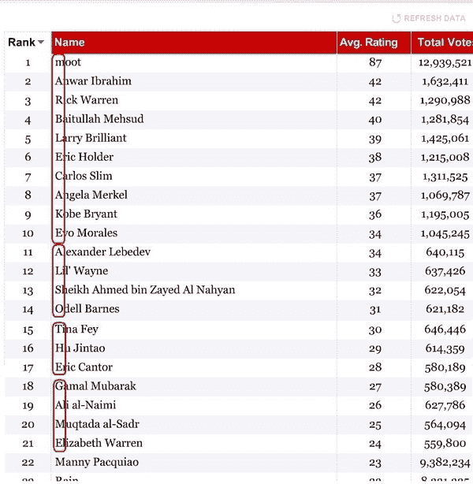

# 4Chan 接管时间 100 | TechCrunch

> 原文：<https://web.archive.org/web/https://techcrunch.com/2009/04/21/4chan-takes-over-the-time-100/>

# 4Chan 接管时间 100

仔细看看《时代》杂志到目前为止对[时代 100 强](https://web.archive.org/web/20230331053922/http://www.time.com/time/specials/packages/article/0,28804,1883644_1886141,00.html)的在线投票结果，你会看到在顶端有一个叫穆特(又名 21 岁的[克里斯托弗·普尔](https://web.archive.org/web/20230331053922/http://www.businessinsider.com/can-4chan-turn-300-million-pageviews-into-a-business-2009-2))的人，他是 [4chan](https://web.archive.org/web/20230331053922/http://www.4chan.org/) 的创始人，这是一个臭名昭著的在线公告牌，黑客们喜欢去那里闲逛。穆特的追随者不仅设法让他的名字登上了《时代》100 名读者的榜首，他们还操纵了接下来的 20 个位置。如果你取每个名字的第一个字母，它会拼出一个神秘的信息，“Marblecake，也是游戏。”(见下图)。**更新**:有消息称，marblecake 也是一个聊天室的名字，“Chanology 项目就是在这里诞生的(4chan 与山达基的战争)。”

结果发现，结果被 4chan 上的一个自动投票程序破解了。(关于黑客攻击的细节，请阅读[这篇文章](https://web.archive.org/web/20230331053922/http://musicmachinery.com/2009/04/15/inside-the-precision-hack/))。这是什么意思？Marblecake 是一个[二年级的性参考](https://web.archive.org/web/20230331053922/http://www.urbandictionary.com/define.php?term=marble%20cake)，这符合 4chan 的精神，它也声称是 Rickrolling 和 Lolcats 开始的地方。

至于时间 100，人民已经说话了。至少在 4chan 上混的人。

