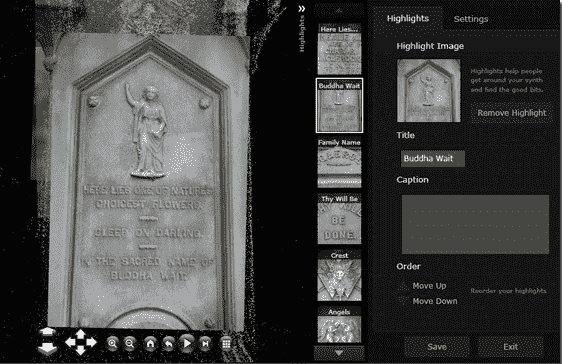

# 苹果电脑现在可以很好地播放 Photosynth 漂亮的 3D 相册了

> 原文：<https://web.archive.org/web/https://techcrunch.com/2009/04/22/macs-now-play-nice-with-photosynths-nifty-3d-photo-albums/>

# 苹果电脑现在可以很好地播放 Photosynth 漂亮的 3D 相册了

微软令人印象深刻的图片浏览项目 Photosynth ，将图片拼接在一起创造出伪 3D 世界，上周进行了重大升级。该应用放弃了 Direct 3D(仅在 Windows 上运行),转而支持微软的跨平台浏览器 [Silverlight](https://web.archive.org/web/20230307225808/http://silverlight.net/themes/silverlight/common/home.aspx?AspxAutoDetectCookieSupport=1) ，这意味着 Photosynth 现在对 Mac 友好。因此，如果你在苹果电脑上，并且在过去两年里只能渴望地看我们对该应用的[报道](https://web.archive.org/web/20230307225808/https://techcrunch.com/tag/photosynth/)，那么[你的机会来了](https://web.archive.org/web/20230307225808/http://photosynth.net/Default.aspx)。

自 12 月 11 日以来，Mac 和 Linux 用户已经能够利用一个实验性的 Silverlight Photosynth 浏览器，但该浏览器直到现在还缺少一些关键功能，Mac 用户还不能真正参与 Photosynth 社区。现在所有的 Photosynth 嵌入都将默认为 Silverlight 格式。此次更新还包括一个新的“高光”功能，这使得你可以更容易地在你正在探索的合成器中找到重要的地标和令人印象深刻的照片(以前你必须漫无目的地四处游荡才能找到最好的照片)。

Photosynth 博客[指出](https://web.archive.org/web/20230307225808/http://blogs.msdn.com/photosynth/archive/2009/04/09/New-Features-Highlights-CrossPlatform-Viewer.aspx)向 Silverlight 的转换带来了一些牺牲——也就是说，用户可能会看到更慢的帧速率和“延迟的点云密度”，但团队正在努力改善这些问题，Silverlight 提供的好处超过了挫折。

Photosynth 还没有真正成为主流，但它已经开始得到更多的关注。今年早些时候，美国有线电视新闻网(CNN)推出了一个名为“ [The Moment](https://web.archive.org/web/20230307225808/http://www.cnn.com/SPECIALS/2009/44.president/inauguration/themoment/) ”的合成器，捕捉到了奥巴马总统的就职典礼(如果你在 1 月份没有时间去看的话，这真的是一个必看的节目)。同样值得一提的是上个月发布的非官方的 Photosynth 浏览器 [iPhone 应用](https://web.archive.org/web/20230307225808/https://techcrunch.com/2009/03/11/isynth-brings-microsofts-powerful-3d-photo-viewer-photosynth-to-the-iphone/)。

很高兴看到这个团队仍然很强大，尽管微软决定[解散](https://web.archive.org/web/20230307225808/http://news.cnet.com/8301-13860_3-10216246-56.html)Live Labs(Photosynth 是其中的一部分)并将其项目分发给其他产品组。**更新**:根据 Live Labs 网站上的[帖子](https://web.archive.org/web/20230307225808/http://livelabs.com/blog/what-s-next-for-live-labs/)，Live Labs 并没有关闭，尽管它的一些员工已经加入了其他产品。

