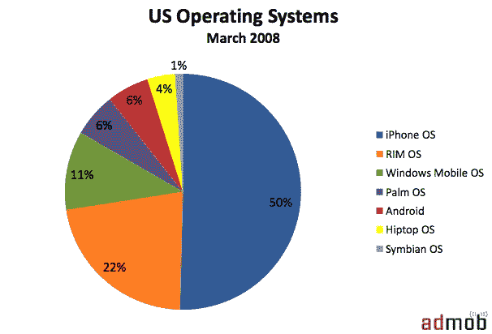
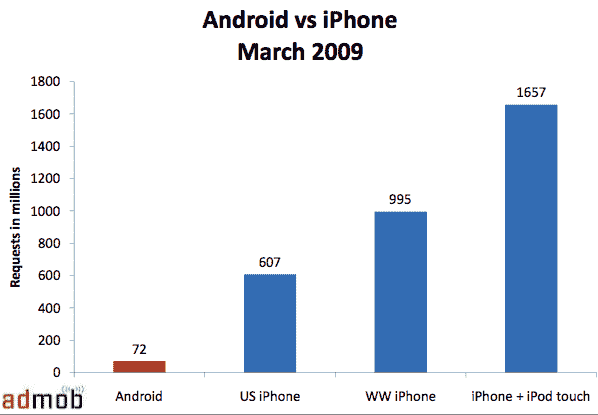
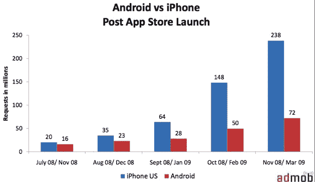

# Android 在移动广告市场份额上赶上了 Palm。IPhone 还是吹走了。TechCrunch

> 原文：<https://web.archive.org/web/https://techcrunch.com/2009/04/23/android-catches-up-to-palm-in-mobile-ad-market-share-iphone-still-blows-it-away/>

# Android 在移动广告市场份额上赶上了 Palm。IPhone 还是吹走了。

Android 在移动广告市场份额方面正稳步增长，在 AdMob 最新的三月[指标](https://web.archive.org/web/20230304101739/http://metrics.admob.com/)中，占所有移动广告请求的 6%。这使得它与 Palm OS 并驾齐驱，相比之下，一个月前 Palm 的份额为 5 %/ 7%。。Windows Mobile 设备的份额也从 13%下降到 11%，而黑莓的 RIM OS 增长了一个百分点，达到 22%，iPhone 保持在 50%。

AdMob 衡量来自移动浏览器和移动应用的广告请求，因此它的数字是移动网络使用的一个很好的代理(当然，减去不提供广告的付费应用)。在设备层面，Android G1 (HTC Dream)实际上超过了 Palm Centro，成为美国网络使用量第四大智能手机(排在 iPhone、黑莓 8300 和黑莓 8100 之后)。

但是 iPhone 仍然让 Android 相形见绌。相比之下，AdMob 在 2009 年 3 月对安卓系统的广告请求为 7200 万次，而在美国对 iPhone 的广告请求为 6.07 亿次。在全球范围内，iPhone 有 9.95 亿次广告请求，如果将它与 iPod touch 结合起来，总数将达到 16.6 亿次。

但这种比较公平吗？iphone 的数量几乎是安卓手机的 20 倍(迄今为止，已经售出 2100 万部 iphone，相比之下，G1 的销量估计约为 100 万部)。考虑到这些比率，Admob 测量的网络使用差异是有意义的。随着越来越多的安卓手机推出，这应该有助于它的数字。

这两个平台上广告请求的一个主要驱动因素是独立应用的激增。Admob 测量了 Android 和 iPhone 上每个应用商店推出后广告请求的增长，发现 iPhone 的增长率为每月 88%，而 Android 为每月 47%。但是这两个平台都远远超过了其他平台。

一旦 Palm Pre 问世，黑莓应用商店获得更多关注，看看 iPhone 和 Android 的相对实力是否会持续下去将是一件有趣的事情。

[http://viewer.docstoc.com/](https://web.archive.org/web/20230304101739/http://viewer.docstoc.com/)
[Admob 指标 2009 年 3 月](https://web.archive.org/web/20230304101739/http://www.docstoc.com/docs/5605953/Admob-Metrics-March-2009)–获取更多[信息技术](https://web.archive.org/web/20230304101739/http://www.docstoc.com/documents/technology/)