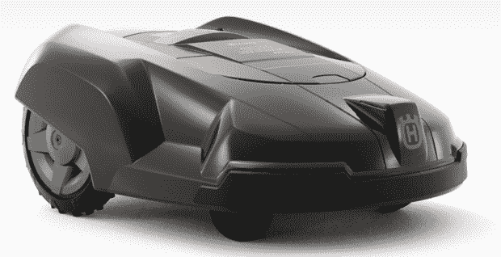

# Husqvarna 机器人割草机会给你发问题短信，在 twitter 上谈论你 TechCrunch

> 原文：<https://web.archive.org/web/https://techcrunch.com/2009/04/23/husqvarna-robotic-mower-will-text-you-problems-twitter-rant-about-you/>

# Husqvarna 机器人割草机会给你发问题短信，在 twitter 上夸夸其谈

维护好草坪是一项全职工作。[富世华](https://web.archive.org/web/20221208201526/http://www.crunchgear.com/tag/Husqvarna/)有一个机器人合作伙伴，也许能给房主更多的自由时间。首先，auto power 260 ACX 会自动割草，但如果有问题，也会给车主发短信。(顺便说一句，推特只是个玩笑)这样，你就不用照看机器人，去看底特律老虎队击败阿纳海姆天使队了。
 [auto ower 260 ACX](https://web.archive.org/web/20221208201526/http://www.thenewsmarket.com/Releases/StoryDetailPage.aspx?GUID=c2f176b8-649e-43f6-a285-0de66de4d936&alertid=6b9f7a7f-e241-4d07-8310-814f56116e53&bhcp=1)不仅仅是割草。很明显，它也可以作为看门狗来抵御鼹鼠、蛞蝓和其他破坏院子的害虫。该设备由电池供电，但 Husqy 也推出了一款类似的汽车，部分由太阳能供电，可能没有短信功能。这些机器人大约需要 45 分钟来修剪一片中等复杂的 1/2 英亩土地。不太坏，但是我喜欢修剪院子。自动除草机器人怎么样？我讨厌那样做。