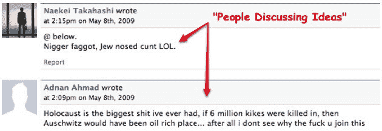
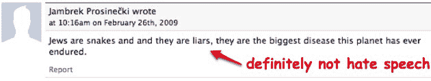
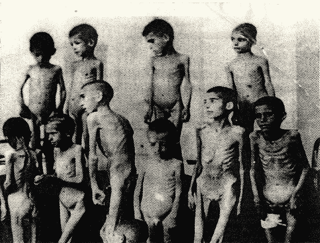

# 脸书欢迎仇视犹太人的人，只要他们不分泌乳汁 TechCrunch

> 原文：<https://web.archive.org/web/http://techcrunch.com/2009/05/10/jew-haters-welcome-at-facebook-as-long-as-they-arent-lactating/>

# 脸书欢迎仇视犹太人的人，只要他们不分泌乳汁

拥有反对否认大屠杀法律的国家(大约 11 个)比拥有母乳喂养法律的国家(0 个)要多得多，但是猜猜哪一个在脸书是被禁止的？没错。[母乳喂养婴儿](https://web.archive.org/web/20230204110755/https://techcrunch.com/2007/09/07/breast-isnt-best-on-facebook/)的照片有伤风化，所以不能拍。

但是否认大屠杀是非常酷的，因为它促进了公开讨论。脸书[想要](https://web.archive.org/web/20230204110755/http://www.cnn.com/2009/TECH/05/08/facebook.holocaust.denial/index.html)“成为一个人们可以讨论各种想法的地方，包括有争议的想法。”甚至，很明显，讨论某人可能是“黑鬼基佬，犹太鼻屄。”这只是我在脸书一个否认大屠杀的网站上发现的众多仇恨信息之一。

布莱恩·库班将移除这些网站视为个人使命。他在争论法律。他在争论服务条款。他在争论常识和礼仪。这些团体显然只不过是向犹太人发泄仇恨的借口，而脸书太胆小，对此无能为力。第一修正案不适用于私营公司。那么，为什么脸书在饥饿的婴儿问题上如此愿意表明立场，但在大屠杀问题上却什么都不做。

因为他们是懦夫。以下是对脸书大屠杀否认组织观点的公开讨论:

如果脸书不想在这个问题上采取道德或伦理的立场，他们可以很容易地证明这些团体违反了他们的服务条款。这些团体违反了 [TOS](https://web.archive.org/web/20230204110755/http://www.facebook.com/terms.php) 的多个部分，尤其是第 3 部分。对于脸书来说，有一个简单的方法可以解决这个问题，而且这也是正确的做法。我不明白为什么他们一定要在沙滩上划一条线，然后和否认大屠杀的人站在同一边。

正在争论的是，这张奥斯威辛集中营的罗马尼亚儿童、医学实验的受害者的照片是否是大屠杀的证据，而这显然可能发生，也可能没有发生。但是没有争议的是，根据脸书的 TOS，这是否是色情作品。确实是。

是的，脸书，这是你选择的立场。

