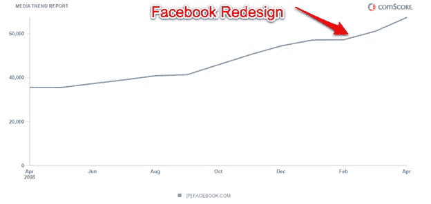
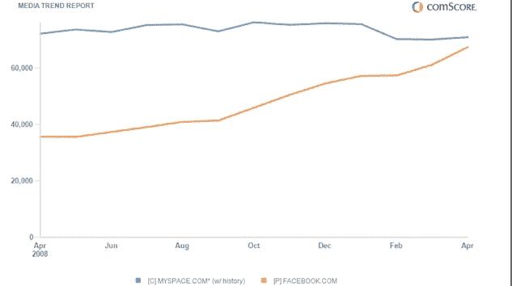

# 不要逆水行舟:脸书和 FriendFeed 的重新设计正在获得回报

> 原文：<https://web.archive.org/web/https://techcrunch.com/2009/05/13/dont-fight-the-stream-facebook-and-friendfeed-redesigns-are-paying-off/?awesm=tcrn.ch_1qB&utm_medium=tcrn.ch-twitter&utm_content=techcrunch-autopost&utm_campaign=techcrunch&utm_source=direct-tcrn.ch>

# 不要逆水行舟:脸书和 FriendFeed 的重新设计正在获得回报

当脸书[在三月初重新设计其主页](https://web.archive.org/web/20221207205456/http://www.beta.techcrunch.com/2009/03/11/facebooks-real-time-homepage-goes-live-today/)，全心全意拥抱实时活动流作为其主要用户界面时，[每个人都抱怨](https://web.archive.org/web/20221207205456/http://www.beta.techcrunch.com/2009/03/19/facebook-polls-users-on-redesign-94-hate-it/)。“这个世界究竟为什么需要两个推特？我在脸书的一个朋友问道。撇开 Twitter 的嫉妒不谈，一些早期数据表明，拥抱流媒体毕竟是正确的决定。

自从重新设计生效以来，脸书的增长已经加速。根据 comScore 的数据，在 2 月份持平增长 0.3%后，脸书在 3 月份增加了近 400 万名美国独立游客(比 2 月份增长 6.6%)，4 月份增加了 500 万名(比 3 月份增长 10.3%)，最终达到 6750 万名国内独立游客。顺便说一句，这使它与 MySpace 4 月份的 7100 万美国独立访客之间的距离很近(见下图)，并与 Twitter 保持着 5000 万访客的良好差距，Twitter 仅在 4 月份就增加了 800 万美国访客。

说到涉水，脸书并不是唯一一个。AOL 也发现了宗教，并正在将“生活流”注入到从 Bebo 到 AIM 的一切事物中。

在另一端，是微小的 FriendFeed，这是一个巨大的活动流。尽管 FriendFeed 在创新方面处于领先地位，但在获得用户方面却一直举步维艰。但是，重新设计后的[在 4 月初进入测试版](https://web.archive.org/web/20221207205456/http://www.beta.techcrunch.com/2009/04/06/new-friendfeed-simpler-faster-better-maybe-too-fast/)，现在是[的默认主页](https://web.archive.org/web/20221207205456/http://www.beta.techcrunch.com/2009/04/29/friendfeed-beta-becomes-friendfeed-regular-hope-you-like-real-time/)似乎正在取得回报，4 月份独立访客增加了 28 %,在该网站上花费的时间增加了。ComScore 仅估计该月有 188，000 名独立访客( [Quantcast](https://web.archive.org/web/20221207205456/http://www.quantcast.com/friendfeed.com) 认为该数字略高，为 241，000 名)，所以它仍然非常小众，但至少其数量现在正朝着正确的方向发展。重新设计后，整个 feed 会持续更新，这样你就可以一边看你的朋友在网上做什么，一边看他们在做什么。

尽管抱怨吧，但是这股潮流会一直存在，而且只会越来越强。

