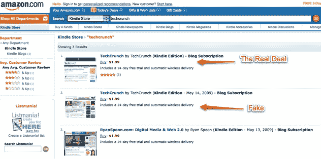
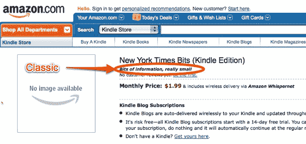
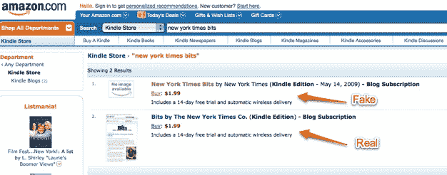
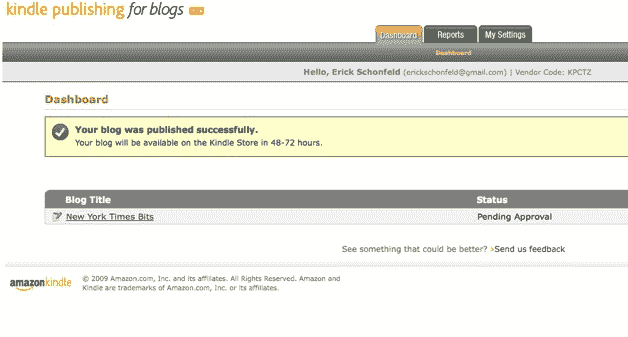
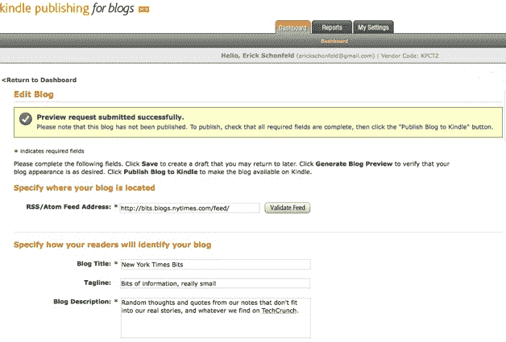
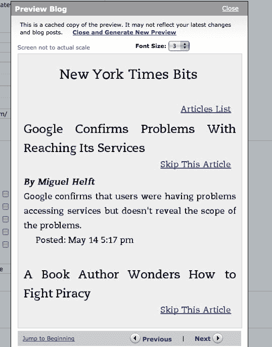

# Kindle 现在如何让你窃取这篇博客

> 原文：<https://web.archive.org/web/https://techcrunch.com/2009/05/14/how-the-kindle-now-lets-you-steal-this-blog/?awesm=tcrn.ch_1wz&utm_medium=tcrn.ch-twitter&utm_content=techcrunch-autopost&utm_campaign=techcrunch&utm_source=direct-tcrn.ch>

亚马逊的新博客发布计划有一个重大缺陷:它允许任何人窃取他人的博客，并向读者收取费用。

昨天，亚马逊向任何注册账户的 T2 开放了在 Kindle 上发布博客的功能。今天，任何人都可以拥有一个博客，即使它不是他们的，收取订阅费，并收取收益。事实上，有人已经在 TechCrunch 上这么做了。

如果你在 Kindle 商店搜索[“TechCrunch”](https://web.archive.org/web/20221207203404/http://www.amazon.com/s/ref=nb_ss_kinc?url=search-alias%3Ddigital-text&field-keywords=techcrunch&x=0&y=0)，最上面的结果是我们的[Kindle 官方博客](https://web.archive.org/web/20221207203404/http://www.amazon.com/TechCrunch/dp/B000NO37QM/ref=sr_1_1?ie=UTF8&s=digital-text&qid=1242333972&sr=1-1)，你可以每月花 1.99 美元订阅。在它的正下方是另一个看起来官方的 TechCrunch 博客，它实际上提供了我们的 feed，价格也是 1.99 美元，但是我们没有看到一分钱。

第二个 Kindle 博客是由 Josh Fraser 创建的， [EventVue](https://web.archive.org/web/20221207203404/http://www.eventvue.com/) 的联合创始人，他立即通知了我们和亚马逊，并提出将它还给我们。他创建这个博客只是想看看他是否能做到，并且惊讶地发现没有验证过程来确保人们确实拥有他们声称的博客。正如弗雷泽指出的:

> 这不仅使我能够获得我不写的博客的收入分成，我还可以改变 feed，以 TechCrunch 的名义向 Kindle 用户发布我想发布的任何内容。

我不太相信这会这么容易，于是我决定在 Kindle Publishing for Blogs Beta 上创建自己的账户，并申请了一个我并不拥有的博客:纽约时报的 Bits 博客。真的很简单。我所要做的就是输入 Bits 博客 RSS 提要的 URL，Amazon“验证”它是一个真正的提要。然后它让我输入博客标题、标语、描述、截图、Kindle 上的标题图片，以及搜索结果中返回该博客的关键词。

显然，您可以在这些字段中放入任何您想要的内容。我忍住没有上传不合适的图片，但确实对标语(“一点点信息，真的很小”)和描述(“不符合我们真实故事的随机想法和我们笔记中的引用，以及我们在 TechCrunch 上找到的任何内容”)感到有点有趣。

现在，如果你在 Kindle 商店搜索[“New York Times Bits”](https://web.archive.org/web/20221207203404/http://www.amazon.com/s/ref=nb_ss_kinc?url=search-alias%3Ddigital-text&field-keywords=new+york+times+bits&x=0&y=0)，我创作的[版本](https://web.archive.org/web/20221207203404/http://www.amazon.com/New-York-Times-Bits/dp/B0029XFDIA/ref=sr_1_1?ie=UTF8&s=digital-text&qid=1242334032&sr=1-1)出现在第一个结果中，而[官方版本](https://web.archive.org/web/20221207203404/http://www.amazon.com/Bits-New-York-Times-Co/dp/B00120YLAW/ref=sr_1_2?ie=UTF8&s=digital-text&qid=1242334834&sr=1-2)出现在第二个结果中。我的标语在那里，如果你订阅我的版本，你的 1.99 美元订阅的 30%将被转到我的银行账户。

不过，别担心。我会把所有收入捐给纽约时报科技记者的午餐基金(你知道，他们的费用账户已经被削减了)。或者亚马逊可以修改它的博客声明程序。

**更新**:显然，不仅仅是博客可以被认领。上传书籍也很容易。记者[保罗·卡尔](https://web.archive.org/web/20221207203404/http://www.paulcarr.com/)发邮件给我们说，他能够把他的书 *[【什么也没给派对带来:一个新媒体妓女的自白](https://web.archive.org/web/20221207203404/http://www.amazon.com/Bringing-Nothing-Party-Confessions-Media/dp/B0029U16GG/ref=sr_1_1?ie=UTF8&s=digital-text&qid=1242343958&sr=1-1)* 】上传到 Kindle 商店，“在不到 24 小时内，甚至没有被要求证明 A)我是作者 b)我拥有美国的电子版权。”谈论打开图书盗版的大门。

**更新 2** :亚马逊已经从 Kindle 商店下架了假冒博客。一名发言人提供了以下声明:

> Kindle Publishing for Blogs Beta 是博客作者向 Kindle 社区发布内容的一种强大方式，我们简化了这一流程，以帮助版权所有者尽快发布他们的内容。
> 
> 偶尔，人们会违反 Kindle 发布博客的条款和条件，发布他们没有权利的材料。在这种情况下，我们会积极删除未经授权的版权材料。
> 
> 一些未经授权的博客的列表是不幸的，我们随后删除了这些标题。

