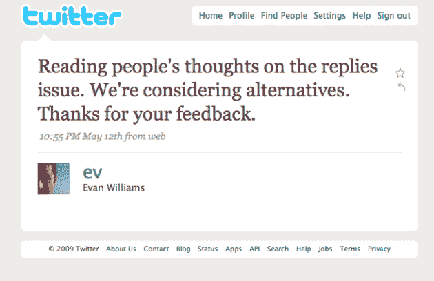

# Twitter 惊人的 24 小时 TechCrunch

> 原文：<https://web.archive.org/web/https://techcrunch.com/2009/05/14/twitters-spectacularly-awful-24-hours/>

Twitter 刚刚经历了可怕的 24 小时。它包括取消一些人喜欢的功能，可能会对它产生误导，受到大量的反对，中途恢复该功能，并因此受到媒体的指责——除此之外还会有几次停机。

这绝不是推特第一次让所有人动武，也不会是最后一次，但令人惊讶的是，该公司似乎通过制造两个问题来解决一个问题。当然，扮演办公椅四分卫很容易，可能有点不公平——但这也很有趣，也是一个很好的警示故事，所以让我们这样做吧。

以下是推特过去 24 小时的情况:

**问题 1** : Twitter [取消了查看@回复的选项](https://web.archive.org/web/20221005191549/http://www.beta.techcrunch.com/2009/05/12/twitter-decides-were-not-smart-enough-for-replies-changes-them-again/)，这些回复是发给你不关注的人的。

**为什么奇怪**:因为这只是一个*选项*，并不是默认设置。用户永远不会喜欢选项被拿走。为什么要删除一个选项？好吧，我们会说到的。

**问题 2** : Twitter 写了[一篇博文](https://web.archive.org/web/20221005191549/http://blog.twitter.com/2009/05/small-settings-update.html)解释说这个变化将“更好地反映”人们如何使用 Twitter。它声称这是基于使用模式和反馈。

**为什么奇怪**:Twitter 在过去几年里没有从脸书学到任何东西吗？如果你要做一个改变，即使你确定这是正确的，在你做之前让用户知道。即使你无意听取反馈，也是如此——这也可能是正确的做法，稍后会有更多介绍。

**问题 3** :杰出的 Twitter 员工开始[在 Twitter 上](https://web.archive.org/web/20221005191549/http://twitter.com/al3x/status/1786897274)表达他们对变革的厌恶。这包括首席执行官伊万·威廉姆斯关于不确定性的推文。

奇怪的原因:如果你真的在做你认为正确的决定，不要含糊其辞——尤其是不要含糊其辞地谈论你创造的让所有人都能看到你的想法的服务。用户将会听到这种胡言乱语，闻到血腥味，然后开始杀戮。

**问题 4** :推特[第二天写了一篇文章](https://web.archive.org/web/20221005191549/http://blog.twitter.com/2009/05/whoa-feedback.html)，包含了下面的句子，“工程团队提醒我，有严重的技术原因，为什么那个场景必须被移除或全部重建……”

**为什么奇怪**:这绝对应该出现在关于此事的第一篇帖子里。见鬼，这应该是第一篇文章的重点主题。现在看起来 Twitter 是故意误导 T7 关于它删除选项的原因。前一天晚上我在吃饭时讨论了这个变化。桌子上的每个人都同意，这显然是为了扩大规模，如果我们都知道这一点，为什么要提醒公司的联合创始人呢？他没有。没有坦诚相待是个错误。

**问题 5 ** : Twitter 因定期维护而关闭，这是一周内的第二次。

**为什么奇怪**:时机不好。用户想要讨论这个新帖子，并通过 Twitter 向 Twitter 提供反馈，但却不能。

**问题 6** : Twitter 紧接着发布了第二篇博文[，仅仅几个小时后就发布了第三篇博文](https://web.archive.org/web/20221005191549/http://blog.twitter.com/2009/05/we-learned-lot.html)，称正在恢复修改的一半。

奇怪的原因:半途而废从来都不是一个好主意。如果你改变或不改变某件事，你会惹恼一些人，但如果你只改变了一半，你会惹恼所有的人。

这些变化似乎会让[的服务变得更加复杂。](https://web.archive.org/web/20221005191549/http://www.beta.techcrunch.com/2009/05/13/kiss-fail-you-can-now-see-replies-sometimes-except-when-you-cant/)

**为什么奇怪** : [简单点，笨蛋](https://web.archive.org/web/20221005191549/http://www.beta.techcrunch.com/2009/04/28/keep-it-simple-stupid/)。这就是 Twitter 如何诞生，如何成长，以及为什么它是现在这个样子。Twitter 试图用这些令人费解的变化来安抚它的用户——在我看来，这不是一个好主意。做或不做，没有尝试。

问题 8 :一台服务器[出现故障](https://web.archive.org/web/20221005191549/http://status.twitter.com/post/107561169/temporary-timeline-delays)，导致 Twitter 几个小时无法使用。

**为什么奇怪**:侮辱到伤害。

糟糕的一天:扮演马后炮很容易，但说 Twitter 严重处理不当也不为过。还不完全清楚是因为使用该功能的用户比例非常小(Twitter API 负责人 Alex Payne 称，只有 3%，[)，还是因为 Twitter 服务器的负担导致了移除的决定。后者很可能是两者的结合。但这需要从一开始就说明。](https://web.archive.org/web/20221005191549/http://twitter.com/al3x/status/1786952335)

移除一个选项，不管有多少比例的用户使用它，通常看起来都不是一个好主意。那些确实使用它的人，显然喜欢它，而其他人可能喜欢将这种选择作为某种安全毯的想法，以防他们想要使用它。这并不是说它不能做——但是如果你要做，确保你 100%致力于消除它。

归根结底，产品是你的，应该由你来决定哪些功能该保留，哪些该删除。倾听你的用户当然很好，但是当涉及到你的产品时，他们中的大多数人可能不知道他们在谈论什么，所以它应该永远不会超出倾听的范围。如果是这样的话——就像它今天对 Twitter 所做的那样——显然有问题。

一个未经深思熟虑的计划会导致这样的日子。当然，脸书有很多这样的网站，Digg 也是，Twitter 也是(规模小得多)——显然，历史在重演。谁知道呢？

就实际的功能删除而言，我对此感到非常兴奋。我有点喜欢通过删除我不关注的用户的@回复来简化我的信息流的想法。一开始我可能会错过，但最终我会忘记这是一个选项。同时，它也是一个很好的发现工具——尤其是对于新用户。

但绝对需要发生的事情对我来说是非常清楚的:Twitter 需要要么彻底杀死它，要么彻底恢复它。当你开始在等式中引入条件语句时，事情会很快变得复杂。这从来就不是 Twitter 的宗旨，也不应该成为它的宗旨。正如我所说，这是他们的产品，但在我看来，这将是一个错误。

但我更担心的是更长期的第二个解决方案。你知道，第三篇文章中谈到的新功能将让用户“对他们关注的账户有更多的控制权。”这听起来很像脸书因其用户的隐私担忧而造成的错综复杂的社会纠纷。作为一个不对称的社交网络，Twitter 不应该有这些问题。

但是在第二个解决方案中有一个潜在的希望之光:过滤器。我希望 Twitter 保持服务的简单和精简，但是它真的需要一个高层次的方法来过滤你关注的人。是的，其他服务也这么做，但是把它放到 Twitter 上实际上可以消除对@回复中太多噪音的担忧。它在 FriendFeed 上运行良好，并开始在脸书上运行。

有一种方法可以把你从今天 Twitter 的惨败中拯救出来:取消所有数据限制，只需给我们过滤器。但是也许不要听我的——毕竟，我只是另一个抱怨的用户。