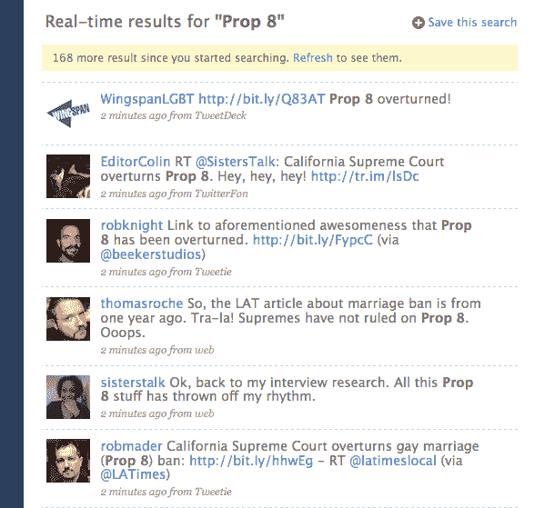
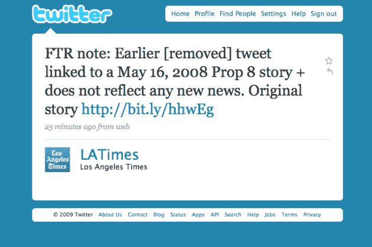

# 据 Twitter 报道，8 号提案在其存在之前就被推翻了

> 原文：<https://web.archive.org/web/https://techcrunch.com/2009/05/15/according-to-twitter-prop-8-was-overturned-before-it-existed/>

# 根据推特，8 号提案在存在之前就被推翻了

现在推特上有一个有趣的热门话题:[第八号提案](https://web.archive.org/web/20230403222552/http://twitter.com/#search?q=%22Prop%208%22)。成千上万的人转发限制同性婚姻的加州投票法案被推翻。唯一的问题？一直没有。

现在的情况是，每个人都在转发这条消息，并链接到[《洛杉矶时报》上的一篇文章](https://web.archive.org/web/20230403222552/http://www.latimes.com/news/local/la-me-gaymarriage16-2008may16,0,6182317.story)称同性恋婚姻禁令已被推翻。但是那些人不会看文章的日期。它发表于一年前，2008 年 5 月 16 日。8 号提案于 2008 年 11 月通过，所以除非我们处于某种*遗失*式的时间扭曲中，否则什么都没有改变。

这件事凸显了 Twitter 的一个缺点。虽然它擅长快速传播信息，但它同样擅长快速传播虚假信息。如果很多人都这么说——成千上万的人都在这里——那一定是真的，对吗？不对。

更糟糕的是，《洛杉矶时报》本身应该为此负责。他们今天早些时候在推特上发布了这篇报道的链接，然后删除了。自那以后，他们发布了一条[撤回声明](https://web.archive.org/web/20230403222552/http://twitter.com/LATimes/status/1809062037)——自然是以推特的形式。

**更新** : [据丹尼·沙利文](https://web.archive.org/web/20230403222552/http://daggle.com/how-prop-8-rumor-on-twitter-started-639)报道，在《洛杉矶时报》发布旧消息之前，美国广播公司新闻有一条关于 8 号提案被推翻的消息，人们也开始在推特上发布。

