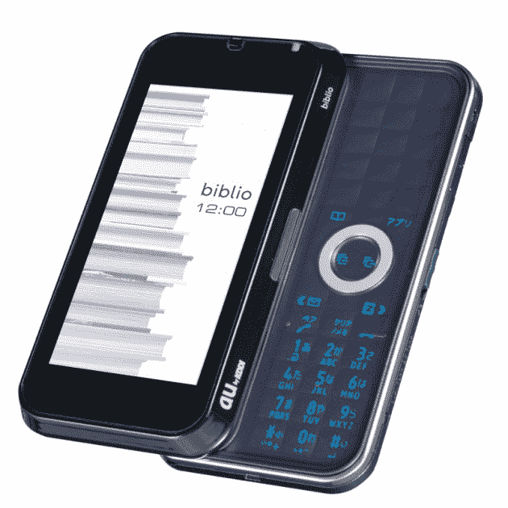
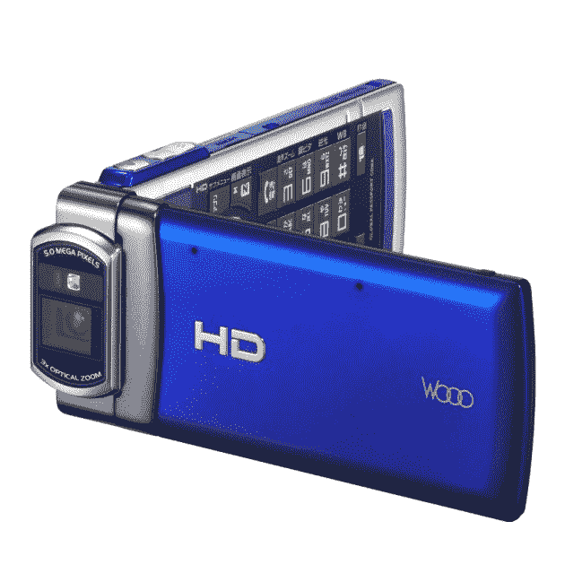
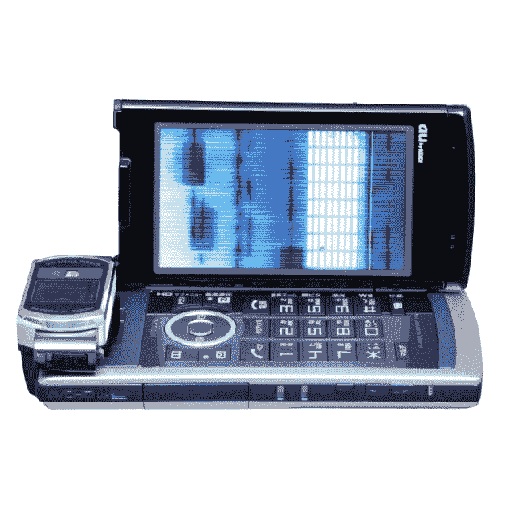
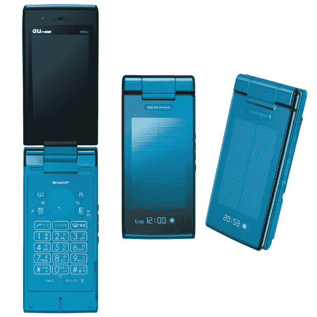

# KDDI au 推出 8 款新手机(部分很棒)

> 原文：<https://web.archive.org/web/https://techcrunch.com/2009/05/25/kddi-au-rolls-out-8-new-and-partly-awesome-cell-phones/>

# KDDI au 推出 8 款新手机(部分很棒)

日本电信巨头[软银](https://web.archive.org/web/20221007025642/http://www.softbankmobile.co.jp/en/index.html)和[Docomo](https://web.archive.org/web/20221007025642/http://www.nttdocomo.com/)上周公布了他们的[夏季](https://web.archive.org/web/20221007025642/http://www.mobilecrunch.com/2009/05/19/docomo-rolls-out-17-partly-awesome-cell-phones-in-japan-part-1-style-and-smart-series/) [2009](https://web.archive.org/web/20221007025642/http://www.mobilecrunch.com/2009/05/19/docomos-cell-phone-line-up-for-this-summer-part-2-prime-and-pro-series/) 阵容，今天紧随其后的是该国第二大运营商 [KDDI au](https://web.archive.org/web/20221007025642/http://www.au.kddi.com/english/) 。虽然软银今年夏天将推出 15 款新手机，Docomo 甚至展示了 17 款，但 KDDI au 早上只展示了 8 款新糖果。但其中一些很神奇。

以下是非盟 2009 年夏季的完整阵容:

东芝图书馆

(带有集成电子书阅读器的手机，3.5 英寸液晶显示屏，分辨率为 960×480，内置 7GB 内存，QWERTY 键盘和 Opera Mobile 9.5，包括 AJAX 支持)

锐运动水球

(防水手机，配有 3 英寸 ASV 触摸屏(480×854)、卡路里跟踪器、体重控制器和其他与运动和健身相关的功能)

 

日立移动高清摄像头 Wooo

(是的，这款手机可以让你以 720p 和 30fps 的速度录制视频，还具有 microSDHC/HDMI 迷你接口和 3 英寸 IPS 屏幕(480×854))

夏普太阳能手机 SH002

([夏普备受期待的太阳能手机](https://web.archive.org/web/20221007025642/http://www.crunchgear.com/2009/04/20/coming-soon-in-japan-at-least-solar-powered-cell-phone/)，配有 3 英寸 AVS 屏幕、500 万像素 CMOS 自动对焦摄像头和微型 SD 卡支持)

东芝 T002

(专为 30 至 40 岁女性设计的超薄机身 GSM 手机)

卡西欧 G'zOne W62CA

(带 LED 灯、电子罗盘和 2.7 英寸 WQVGA 屏幕的防水手机)

京瓷 K002

(超薄(10.9 毫米)手机，针对 30 多岁和 40 多岁的男性)

京瓷 Kantan Keitai K003

(针对 60 岁以上用户的简单易用的标准手机)