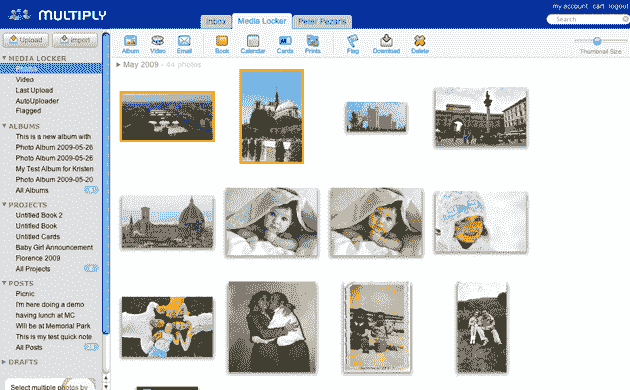

# 乘法 4.0:社交网络照片分享做得好| TechCrunch

> 原文：<https://web.archive.org/web/https://techcrunch.com/2009/05/26/multiply-40-social-network-photo-sharing-done-right/>

[Multiply](https://web.archive.org/web/20230307104938/http://www.multiply.com/) ，一个专注于与朋友和家人分享媒体的社交网络，将于明天上午 10 点进行重大升级，引入一个经过彻底检查(和大幅改进)的界面，广泛的照片编辑功能，一个完全集成的照片整理平台。

Multiply 没有像脸书和 MySpace 这样的大公司那样受到那么多关注，但它已经建立了坚实的用户基础，其中一些用户通过其高级账户为公司提供了稳定的收入来源。脸书等其他社交网络已经接受了帮助用户广泛分享他们的想法和照片的心态，Multiply 则坚持认为，有时用户只想与少数好朋友和家人分享他们的个人媒体。

随着最新版本的发布，Multiply 希望拥抱“数字妈妈”。认识到该网站的许多成员是成年人，他们希望与所爱的人分享他们的媒体，该网站采用了一个最好被描述为媒体收件箱的界面。当你第一次登录时，网站会呈现给你一系列类似于脸书新闻的内容(事实上，Multiply 早在脸书之前就有新闻了)。您朋友的最新事件、信息和相簿出现在主栏中，每个旁边都有缩略图。

通过新界面的导航主要围绕着屏幕左侧的新侧边栏，这很像你可能在电子邮件客户端看到的东西。该面板包括您最重要的朋友和家人的链接，让您可以确保了解他们的所有最新动态。同样，网站的群组也有过滤器，你可以创建强大的自定义过滤器——这一特性将吸引高级用户。

除了这些新项目，Multiply 4.0 的另一个主要领域是媒体柜，你可以上传和管理你所有的照片，视频和博客文章。这是新网站真正的亮点——Multiply 4.0 的照片管理器与 iPhoto 等原生照片软件非常相似，允许你将照片拖放到任何你喜欢的相册中。您可以使用滑块来调整导航期间缩略图的显示大小，顶部栏包括方便的链接，让您可以通过电子邮件或 Multiply 本身快速共享相册。将照片导出到网站的打印店面也容易得多，它允许你将你的图像打印到实体相册、杯子和其他产品中。

媒体锁定器还包括许多基本的照片编辑功能，如红眼消除、颜色调整和图像裁剪。Multiply 不是第一个提供这些功能的社交网络(MySpace [今年早些时候推出了](https://web.archive.org/web/20230307104938/https://techcrunch.com/2009/03/19/myspace-launches-in-browser-photo-editing-tools/)类似的工具)，但与 MySpace 编辑器不同的是，Multiply 不需要 Flash 嵌入。为了让你的照片上传到 Multiply 上，该网站为你的电脑照片软件提供了一系列插件，以及一个 AIR 应用程序，可以监控你的文件夹中从你的相机导入的任何新图像。

我对新网站的一个主要不满是侧边栏不一致的外观。虽然当你在收件箱或媒体锁定器部分时，它会根据上下文出现和变化，但每当你访问朋友个人资料中的页面或相册时，侧边栏就会消失。您仍然可以使用屏幕顶部的链接返回到其他页面，但奇怪的是，似乎持久不变的 UI 元素偶尔会消失(想象一下，如果脸书页面底部的菜单栏只是偶尔出现)。

除此之外，Multiply 的新网站看起来很可靠，提供了一个可以真正公平对待你的媒体的社交网络。脸书可能是网络上领先的照片分享服务，它非常适合与朋友分享日常照片。但对于那些真正重要的照片，你不能击败全分辨率，这是脸书不提供的。Multiply 允许用户上传全分辨率照片，可以选择每年支付 20 美元购买无限量的存储空间，以便将它们全部备份(更不用说它更广泛的照片编辑功能了)。Multiply 不会很快超过脸书或 MySpace，但它在弥合 Flickr 等照片共享服务和更大的社交网络之间的差距方面做得很好。

[http://images.multiply.com/multiply/multv.swf](https://web.archive.org/web/20230307104938/http://images.multiply.com/multiply/multv.swf)