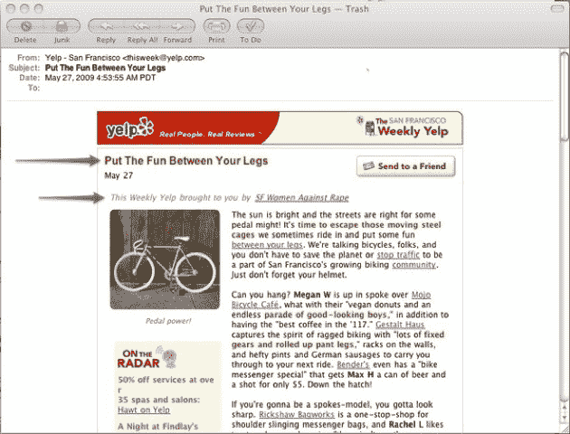

# 这么看吧，Yelp。至少你没有删除所有用户帐户 TechCrunch

> 原文：<https://web.archive.org/web/https://techcrunch.com/2009/05/27/look-at-it-this-way-yelp-at-least-you-didnt-delete-all-your-user-accounts/>

# 这么看吧，Yelp。至少你没有删除你所有的用户账户

Yelp 的过了糟糕的一天。这可能不像艾明迪的一天那么糟糕，他设法[删除了他们所有的用户账户](https://web.archive.org/web/20230216172236/https://techcrunch.com/2009/05/27/imindi-we-accidentally-deleted-all-the-user-accounts/)，但这仍然是一件好事。

Yelp 成功地将一篇关于骑自行车的时事通讯文章中通常没有攻击性的标题(*“把乐趣放在你的双腿之间”*)与一个高尚的赞助商( [SF 妇女反对强奸](https://web.archive.org/web/20230216172236/http://www.yelp.com/events/san-francisco-dine-for-a-change-a-benefit-supporting-services-for-survivors-of-rape-and-sexual-assault))搭配起来[制造了一个令人不快和尴尬的局面。除此之外，那些话没问题。把它们放在一起，人们会发疯。](https://web.archive.org/web/20230216172236/http://twitpic.com/62udn)

标题已改为*“更正:为 Yelp 打造的自行车！”*伴随着一条消息*“由于编辑疏忽，早期版本的 Yelp 周刊包含了一个不适合上下文的标题。我们为这个错误道歉。”*他们也在推特上[道歉](https://web.archive.org/web/20230216172236/http://twitter.com/YelpInc/status/1938161687)，在那里时事通讯成了人们谈论的话题[。](https://web.archive.org/web/20230216172236/http://search.twitter.com/search?q=yelp+rape)