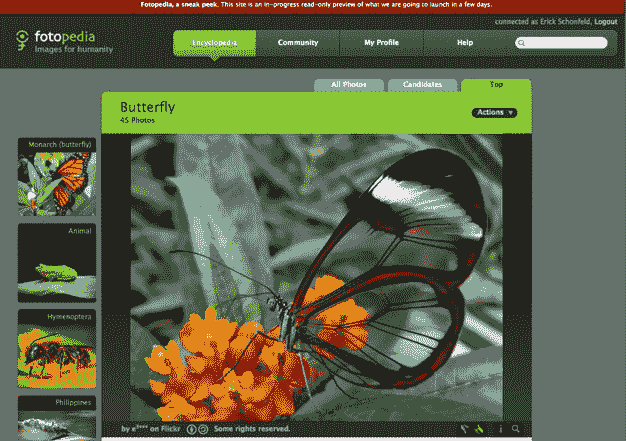
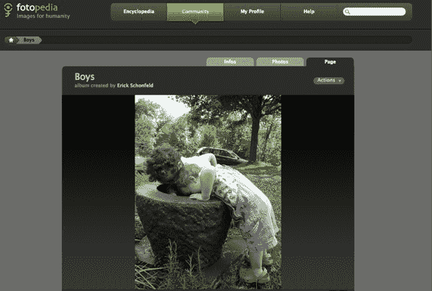

# Fotonauts 在其即将推出的 foto pedia TechCrunch 上提供了一个偷偷摸摸的高峰

> 原文：<https://web.archive.org/web/https://techcrunch.com/2009/05/31/fotonauts-offers-a-sneak-peak-at-its-upcoming-fotopedia/>

# Fotonauts 在其即将推出的 Fotopedia 上提供了一个偷偷摸摸的高峰

当 [Fotonauts](https://web.archive.org/web/20230131174329/http://www.fotonauts.com/) 在去年的 TechCrunch50 上首次亮相时，我称它为[“华丽的照片媒体”](https://web.archive.org/web/20230131174329/http://techcrunch.com/2008/09/10/tc50-fotonauts-is-a-georgeous-photopedia/)，因为它承诺将你的相册变成关于不同主题的合作网页。Fotonauts 是一个桌面照片客户端，可以帮助你标记、组织和分享你的照片，目前仍处于私人测试阶段。但是你可以在刚刚试运行的 [Fotopedia](https://web.archive.org/web/20230131174329/http://www.fotopedia.com/) 上看到面向网络的版本。页面顶部的一条消息写道:“Fotopedia，先睹为快。该网站是我们几天后将要推出的内容的正在进行中的只读预览。”

Fotonauts 尚未开放的功能之一是将任何相册转换成网页的能力，包括标签、相关的维基百科条目和可用的谷歌地图信息。Fotopedia 展示了一些你可以在 Fotonauts 客户端看到的公共相册，此外它还增加了一些变化。每张照片都可以被投票赞成或反对，或者被标记为不合适。有一个百科全书标签，按主题/标签显示相册。例如，你可以看到关于[火山](https://web.archive.org/web/20230131174329/http://www.fotopedia.com/en/Volcano)、[蝴蝶](https://web.archive.org/web/20230131174329/http://www.fotopedia.com/en/Butterfly)或[威尼斯](https://web.archive.org/web/20230131174329/http://www.fotopedia.com/en/Venice)的专辑。

已经有近 150，000 张高质量的照片，被组织成 4，289 篇“文章”每篇文章都是网络幻灯片，以及相关的维基百科条目和谷歌地图。每张照片都包含大量的元数据，这使得它对搜索引擎很友好。Fotopedia 应该是 Flickr 和维基百科的结合体，是一个“人类图像”的长期档案库。Fotonauts 的创始人 Jean-Marie Hullot 在一份说明中解释道:“Flickr 和其他照片网站只能让你在很短的时间内曝光，向维基百科添加照片对普通用户来说太复杂了。”

除了照片，还有一个活跃的社区。您可以关注其他人或特定的相册。登录后，您还可以查看个人资料。您也可以将相册作为 widgets 共享。(下面我已经收录了火山和蝴蝶专辑的部分)。

