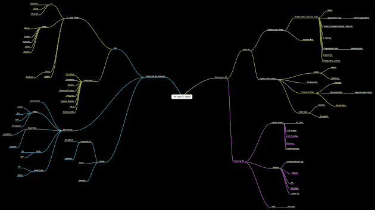

# Twitter 的未来可视化 TechCrunch

> 原文：<https://web.archive.org/web/http://techcrunch.com/2009/06/01/the-future-of-twitter-visualized/>

# Twitter 的未来被可视化了

昨天在三藩市举行的 TWTRCON 大会上，史蒂夫鲁贝尔展示了他制作的名为“Twitter 的未来”的思维导图在他的许可下，我在下面嵌入了这张地图，这是一种观察服务状态的有趣方式。

它开始分为两个不同的方向:“Twitter 和生态系统”，以及“Twitter 作为一个操作系统。”一方面，从可能的威胁(可能杀死 Twitter 的服务)、可能收购 Twitter 的公司以及可能被收购的公司来看，Twitter 未来可能会发生什么。另一方面，Twitter 是一个社交操作系统，而不是营销操作系统。从那里，它进入了作为平台的角色，以及基于它的应用程序的兴起。

这张地图很好地展示了互联网上涉及 Twitter 的日益复杂的关系网络。随着这项服务越来越受欢迎，这个网络只会继续扩大，除非其中一个威胁摧毁它，或者如果一个更大的公司收购它。鲁贝尔在[他的帖子里有更多关于此事的内容。](https://web.archive.org/web/20230203062556/http://www.micropersuasion.com/2009/06/what-is-the-the-future-of-twitter-only-you-know.html) [Brian Solis](https://web.archive.org/web/20230203062556/http://www.briansolis.com/) 和 [Jess3 的](https://web.archive.org/web/20230203062556/http://jess3.com/) Twitterverse [图](https://web.archive.org/web/20230203062556/http://www.flickr.com/photos/briansolis/3570379944/)也提供了一个很好的观察 Twitter 状态的视觉效果。

*点击图片查看大图*

*【图片:flickr/ [史蒂夫鲁贝尔](https://web.archive.org/web/20230203062556/http://www.flickr.com/photos/steverubel/3585087321/)】*