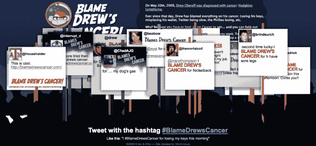

# 如果你讨厌关于 Twitter 的帖子

> 原文：<https://web.archive.org/web/https://techcrunch.com/2009/06/04/if-you-hate-posts-about-twitter-blamedrewscancer/>

# 如果你讨厌关于 Twitter 的帖子，# BlameDrewsCancer

当我们写一些与 Twitter 相关的东西时，经常是[有趣](https://web.archive.org/web/20230331185132/https://techcrunch.com/2009/06/04/hey-there-tony-la-russa-is-suing-twitter/)或者愚蠢——或者[两者都是](https://web.archive.org/web/20230331185132/https://techcrunch.com/2009/05/12/kayne-west-is-mad-as-hell-at-twitter-and-hes-not-going-to-take-this-anymore/)。但重要的是要记住，Twitter 的核心是一个强大的信息传播媒介。有时候，这种力量可以用来做好事——比如对抗癌症。

德鲁·奥拉诺夫，一个在网络圈相当知名的人，最近得到了一些可怕的消息:[他得了癌症](https://web.archive.org/web/20230331185132/http://www.drewolanoff.com/post/117383549/thats-not-what-i-ordered)。这大概是所有人都想听到的最糟糕的消息了。但是奥拉诺夫没有坐以待毙，而是决定积极主动，利用糟糕的情况做点好事。他与开发者迈克·德默斯(Mike Demers)合作创建了一个网站，要求你将生活中的所有问题归咎于德鲁的癌症。

最棒的是，人们喜欢用 Twitter 发牢骚。见鬼，我和其他人一样做这件事——那是一段美好的过去时光。但通常这些推文对你的大多数粉丝来说只是蹩脚的抱怨。但是现在，使用# blamdrewscancer hash-tag，所有这些推文都被拉进网站，在那里它们将被记录，有望为美国癌症协会和许愿基金会带来大笔捐款。

作为一个在一系列公司中大量参与网络空间一段时间的人，Olanoff 意识到 Twitter 是他信息的完美媒介。就在网站启动后的几天，它就开始发挥巨大的作用。今天早上，原因是推特上的热门话题。甚至连拥有不到 100 万粉丝的兰斯·阿姆斯特朗[也在推特上发布了这条消息](https://web.archive.org/web/20230331185132/http://twitter.com/lancearmstrong/status/2029547668)。

以下是一些其他的好例子:

> [贝多桑多](https://web.archive.org/web/20230331185132/http://twitter.com/betosando) 一世 [# **中东战争**](https://web.archive.org/web/20230331185132/http://twitter.com/search?q=%23BlameDrewsCancer "#BlameDrewsCancer")
> 
> [法胡迪](https://web.archive.org/web/20230331185132/http://twitter.com/Farhoudi) 我把美国 0 比 3 输给哥斯达黎加归咎于德鲁的癌症。[http://**blamedrewscancer**。com](https://web.archive.org/web/20230331185132/http://blamedrewscancer.com/)
> 
> [打喷嚏](https://web.archive.org/web/20230331185132/http://twitter.com/sneezymonica) 我 [# **责备我的脚痛！**](https://web.archive.org/web/20230331185132/http://twitter.com/search?q=%23BlameDrewsCancer "#BlameDrewsCancer")**[http://**blamedrewscancer**。com/](https://web.archive.org/web/20230331185132/http://blamedrewscancer.com/)**
> 
> [rhonigwachs](https://web.archive.org/web/20230331185132/http://twitter.com/rhonigwachs)I[#**blamedrewscancer**](https://web.archive.org/web/20230331185132/http://twitter.com/search?q=%23blamedrewscancer "#blamedrewscancer")为专有 linux 驱动

幸运的是，奥拉诺夫的[霍奇金淋巴瘤](https://web.archive.org/web/20230331185132/http://en.wikipedia.org/wiki/Hodgkin_disease)有很好的治愈率。我们祝愿他在接受数月治疗的过程中一切顺利。但他现在需要的是一些公司挺身而出，承诺为每一个在推特上发布他的# blamedrewscancer 消息的人捐赠 1 美元。

如今，几乎每家公司都在谈论如何利用 Twitter 来进一步推广自己的品牌。我认为没有比此时此地更好的机会了。

