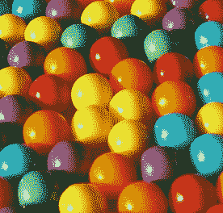

# Candy.com 售价高达 300 万美元

> 原文：<https://web.archive.org/web/https://techcrunch.com/2009/06/05/candycom-sells-for-a-sweet-3-million/>

# Candy.com 售价高达 300 万美元

就在昨天，我们[报道了如何。在经历了黯淡的 2008 年后，T2 的域名注册量开始回升。今天带来了进一步的证据，candy.com 刚刚以 300 万美元的价格将域名卖给了 G & J 控股公司。这使得它成为今年第二大域名收购案，紧随玩具反斗城收购 toys.com T4 之后。](https://web.archive.org/web/20230326192113/https://techcrunch.com/2009/06/04/the-dot-coms-are-booming-again-domain-registrations-that-is/)

G&J 控股公司计划利用 candy.com 来销售——听着——糖果。他们希望成为你所有糖果需求的在线目的地，提供快速运输和有竞争力的价格产品，以及良好的购物体验。但是说真的，当你有了令人敬畏的 candy.com 域名后，所有这些又有什么关系呢？新闻稿称，每个月“糖果”一词的搜索量超过 80 万次，因此标价 300 万美元。

这笔交易实际上在几个月前就准备好了，但是花了这么长时间才最终敲定(意思是:让律师审核)。这个网站是从“域名之王”那里购买的，他掌握了这个网站的所有细节。他的真名是里克·施瓦茨，去年他以 75 万美元的价格将 ireport.com 域名卖给了 CNN，从而一举成名。他还拥有 property.com，但随着经济崩溃，该公司以荒谬的价格卖给了 foreclosure.com。

*【感谢[麦克](https://web.archive.org/web/20230326192113/http://www.domainmassdevelopment.com/)*

*【图片:flickr/ [弗吉尼亚州的特伦](https://web.archive.org/web/20230326192113/http://www.flickr.com/photos/8136496@N05/2099062718/)*