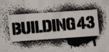
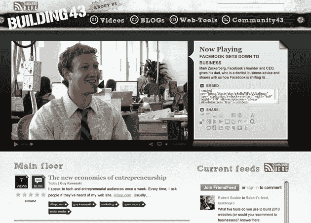

# Scoble 的 Building 43 今晚发布，为停滞在 90 年代的企业提供实用技巧 TechCrunch

> 原文：<https://web.archive.org/web/https://techcrunch.com/2009/06/11/scobles-building-43-launching-tonight-with-practical-tips-for-businesses-stuck-in-the-90s/>

# 斯考伯的 43 号楼今晚发布，为停滞在 90 年代的企业提供实用提示

 今晚，罗伯特·斯考伯的最新项目 [Building43](https://web.archive.org/web/20221006021745/http://www.building43.com/) 发布，这是他与虚拟主机提供商 [Rackspace](https://web.archive.org/web/20221006021745/http://www.rackspace.com/index.php) 合作建立的一个在线社区(我们请他们来我们的[生日派对](https://web.archive.org/web/20221006021745/http://www.beta.techcrunch.com/2009/06/11/happy-4th-birthday-techcrunch/)上和我们一起庆祝)。当我们第一次听说这个新网站时，斯考伯把它描述为“为狂热的互联网爱好者服务的社区”。他仍然坚持那个模糊的口号，但现在他实际上的意思变得有点清楚了。

该网站的目标是帮助企业使用现代技术和社交网站来增加他们的曝光率和赚钱。但它并没有关注最新的突发新闻，而是寻求提供更多实用的建议，比如如何“推销你的脸书主页”(见下面的视频)，或者盖伊·川崎的博客文章[创业的新经济学](https://web.archive.org/web/20221006021745/http://www.building43.com/blogs/2009/06/11/guy-kawasaki/)。

[http://blip.tv/play/g8sRgYiPEpTqFQ%2Em4v 电视台]

Scoble 说，他之前提供的内容和 Building43 之间的最大区别将是对实用技巧的新强调，尽管仍然会有更多的一般性采访。他说，我们最初预计每周可以看到两个新视频，但随着网站的发展，很快就会每天都有新的视频功能(也会有定期的博客帖子)。他首先列出了一份令人印象深刻的受访者名单，包括弗雷德·威尔逊、马克·扎克伯格和玛丽莎·梅耶尔。

43 号楼有五个人全职在网站上工作，但它也希望接受来自社区的内容。在同意 Creative Commons 3 许可协议后，用户将能够上传视频和博客文章，该网站还将提供一个 FriendFeed room，用于监控 43 号楼一词在网络上的提及情况。希望任何时候你有一个适用于商业的技术提示，你可以通过在你的帖子或推文中提到它来与 Building43 社区分享。

43 号楼有一个好主意——众所周知，有无数企业的网站停留在 90 年代，完全不知道如何利用社交媒体。但它仍然必须找到一种方法，让这些企业意识到 43 号楼，这不会是一个简单的任务(如果他们不知道如何使用脸书，他们很可能不知道罗伯特·斯考伯是谁，也不知道 43 号楼的存在)。

要听 Scoble 用他自己的话谈论 43 号楼，以及他对小丑计算的想法，请查看昨天在 TechCrunch 办公室拍摄的这段 Qik 视频。

