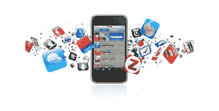

# 最常用的 iPhone 应用程序

> 原文：<https://web.archive.org/web/http://techcrunch.com/2009/06/12/techcrunchs-most-frequently-used-iphone-apps/>

# TechCrunch 最常用的 iPhone 应用程序

大多数 TechCrunch 作者都是 iPhone 用户。当我们还在争论下周五~~是否~~ ~~何时~~何时 [iPhone 3G S](https://web.archive.org/web/20230203003853/http://techcrunch.com/2009/06/08/say-hello-to-the-iphone-3gs-s-is-for-screaming-fast/) 时，我们对下周三 [iPhone OS 3.0](https://web.archive.org/web/20230203003853/http://www.crunchgear.com/2009/06/08/iphone-30-available-on-june-17-worldwide/) 感到兴奋。我们收到了一些发布我们在 iPhones 上使用的应用程序的请求，现在我们将与您分享这些信息。

以下列表绝不是我们 iPhones 上所有的应用程序。有很多应用程序我们一个月只使用几次(例如 [Shazam](https://web.archive.org/web/20230203003853/http://www.shazam.com/music/web/pages/iphone.html) )，但是当我们需要它们的时候，它们非常棒。我们还链接了 TechCrunch/crunch gear/mobile runch 对这些应用的评论。请在下面的评论中告诉我们你使用哪些应用程序。