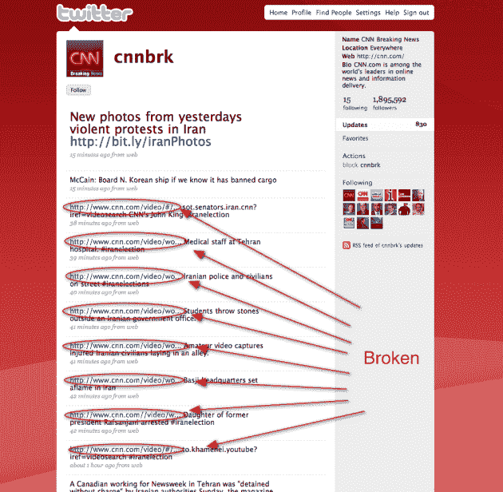

# CNN 热爱 Twitter，但似乎不总是知道如何使用它 TechCrunch

> 原文：<https://web.archive.org/web/https://techcrunch.com/2009/06/21/cnn-loves-twitter-but-doesnt-seem-to-always-know-how-to-use-it/>

# CNN 热爱 Twitter，但似乎并不总是知道如何使用它

如果你在过去的一周里把电视调到 CNN，你可能已经见证了一场席卷全球的爱情事件。当我说我认为 CNN 的主持人在那段时间里使用“推特”这个词比说“CNN”还多的时候，我甚至不是在开玩笑。虽然有些人讨厌这一点，但我认为这很棒，因为这项服务提供了非常非常有价值的服务，可以传播关于伊朗目前正在发生的事情的信息。但如果 CNN 不能正确使用其 Twitter 账户来传播新闻，这些都无关紧要。

现在看看 CNN 突发新闻推特账号。其最近 10 条推文中有 8 条包含断开的链接。这是一个拥有近 200 万粉丝的 Twitter 账户，CNN 在其节目中独一无二地推广它，它吸引了 404 万人。

为什么这很重要，当然是因为很多人把这个账号作为获取伊朗新闻的主要途径。当 CNN [在推特上发布](https://web.archive.org/web/20221006211751/http://twitter.com/cnnbrk/status/2268004254)类似*“前总统拉夫桑贾尼的女儿被捕# Iran election”*的事情，然后有一个链接不起作用，[很多人](https://web.archive.org/web/20221006211751/http://twitter.com/#search?q=cnnbrk%20broken)显然非常不安。

如果你坚持把你的大部分报道建立在 Twitter 和 CNN 的基础上，请想好如何使用它。

**更新**:看起来 CNN 在断链一个小时后想通了。无论是谁运行他们的账户，都开始使用 [TweetDeck](https://web.archive.org/web/20221006211751/http://tweetdeck.com/beta/) 而不是网络，所以现在所有的链接都使用 [Bit.ly](https://web.archive.org/web/20221006211751/http://bit.ly/) URL 缩短服务。但这也很有趣。拥有天然网址已经很短的 CNN 为什么不干脆自己做短网址？这样一来，如果 Bit.ly 这样的服务出现故障，也能保证它们正常工作。