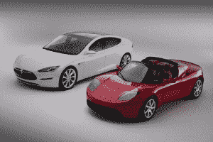

# 政府为特斯拉的电动轿车提供了 4.65 亿美元的贷款

> 原文：<https://web.archive.org/web/http://techcrunch.com/2009/06/23/the-government-comes-through-for-tesla-with-a-465-million-loan-for-its-electric-sedan/>

# 政府为特斯拉的电动轿车提供了 4.65 亿美元的贷款

美国能源部长今天在密歇根州迪尔伯恩的福特研究中心宣布，将提供政府帮助汽车制造商的 250 亿美元计划中首批贷款的细节。福特获得了 59 亿美元的贷款，但硅谷的电动汽车制造商特斯拉汽车[将从该计划中获得 4.65 亿美元。这笔钱将用于完成其现代 S 轿车和电动动力系统的开发，这两个项目已经获得了其他汽车制造商的许可，如奔驰 T8。上个月，梅赛德斯的母公司戴姆勒也投资了 5000 万美元购买特斯拉 10%的股份。这使得该公司的债务和股权投资总额超过了 2 亿美元。现在，加上政府贷款，资金总额达到了 7 亿美元。](https://web.archive.org/web/20230327202106/http://www.teslamotors.com/)

如果政府将发放贷款，帮助汽车制造商生产更节能的汽车，那么很高兴看到部分资金慢慢流入，帮助电动汽车走出图纸，进入车道。特斯拉计划将贷款中的 3.65 亿美元用于加速 S 型轿车的生产，剩余的 1 亿美元用于加州的电动火车制造工厂，该工厂的租赁谈判已进入最后阶段。

昨天[在一篇](https://web.archive.org/web/20230327202106/https://techcrunch.com/2009/06/22/tesla-ceo-elon-musk-sets-the-record-straight-about-pending-lawsuit/)[长文的结尾](https://web.archive.org/web/20230327202106/http://www.teslamotors.com/blog2/)回应了特斯拉联合创始人马丁·艾伯哈德在诉讼中的指控，特斯拉首席执行官埃隆·马斯克透露，随着全电动跑车产量的增加，该公司有望在下个月实现盈利。他还写道，该公司已经收到了 1000 多份 Model S 轿车的预订单，高于第一周的 [500 份。扣除税收优惠后，Model S 的价格约为 5 万美元，是跑车价格的一半左右。在文章中，他解释了跑车如何让轿车成为可能:](https://web.archive.org/web/20230327202106/https://techcrunch.com/2009/04/01/520-tesla-s-sedans-reserved-in-one-week-company-gets-26-million-in-fees/)

> 特斯拉有时会因为我们的第一辆车相对昂贵而受到批评，暗示我们认为富人缺乏跑车！显然，只有当人们买得起电动汽车时，才会向电动汽车过渡。然而，对于试图创造突破性技术的小型创业公司来说，像 Roadster 这样的低产量和相当昂贵的产品是唯一现实的初始选择。任何领域的新技术在进入大众市场之前都需要几个版本的优化，在这种情况下，它要与 150 年来花费在汽油车上的数万亿美元竞争。
> 
> 不过，我想说清楚的是，我们正在努力尽快到达那里。我投入如此多的时间和金钱来帮助创建特斯拉的主要原因是为了加快向电动汽车的过渡。这不是一个排序可能的投资回报，并得出结论，汽车行业是最容易赚钱的例子！虽然我相信特斯拉将为投资者带来丰厚的回报，但建立一家汽车公司肯定是最难赚钱的方式之一。

4 . 65 亿美元的贷款应该会有所帮助。