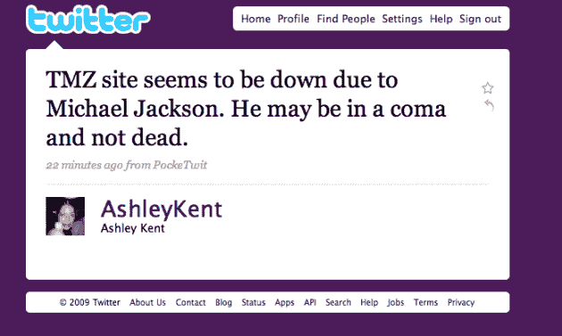
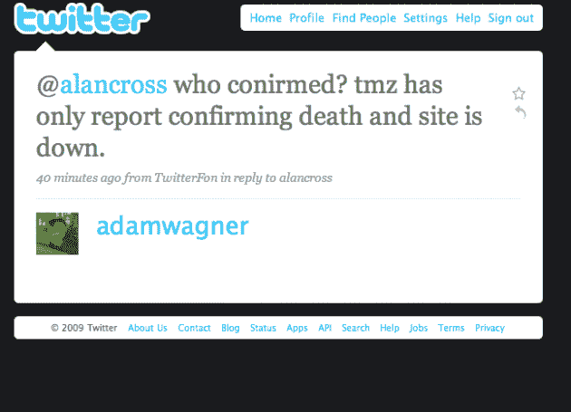
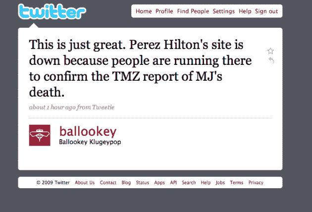
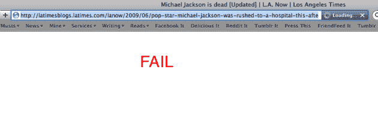
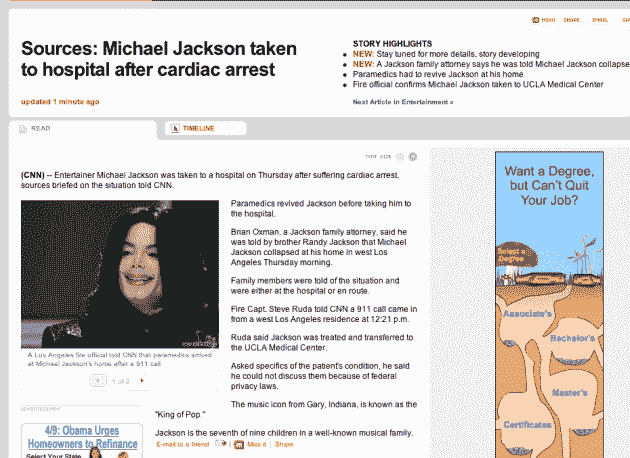

# 网络在迈克尔·杰克逊死亡的重压下崩溃

> 原文：<https://web.archive.org/web/https://techcrunch.com/2009/06/25/the-web-collapses-under-the-weight-of-michael-jacksons-death/>

# 在迈克尔·杰克逊去世的重压下，互联网崩溃了

就众所周知的名人而言，很少有人比迈克尔·杰克逊更有名。爱他或恨他，几乎这个星球上的每个人都认识他。他去世的消息给许多大型网站带来了大问题。

据报道，T2 在很短的时间内发布了成千上万条关于杰克逊的推文，这可能是意料之中的事情。虽然我只得到一对夫妇真正的失败鲸鱼，该网站真的吸了很多时间的风，人们试图获得关于他的信息。但是 Twitter 并不是唯一一个苦苦挣扎的网站。

各种报道都有 AOL 拥有的 TMZ，它[打破了](https://web.archive.org/web/20230331185128/http://www.tmz.com/2009/06/25/michael-jackson-dies-death-dead-cardiac-arrest/)的故事，在整个磨难中[在多个点](https://web.archive.org/web/20230331185128/http://twitter.com/AshleyKent/statuses/2333430366)被关闭。因此，佩雷兹·希尔顿非常受欢迎的[博客](https://web.archive.org/web/20230331185128/http://perezhilton.com/)可能已经[失败](https://web.archive.org/web/20230331185128/http://twitter.com/ballookey/statuses/2332879280)了，因为人们冲到那里试图证实这个消息。然后是《泰晤士报》报道说杰克逊只是处于昏迷状态，而不是死亡，所以人们蜂拥而至，然后那个网站就瘫痪了。(最后《泰晤士报》证实了他的去世。)

与此同时，CNN 并没有倒下，而是因为另一个原因失败了。CNN 首先说杰克逊在去医院之前已经苏醒(见底部截图)。

**更新**:以防你不相信这个故事现在正主宰着网络，推特上的 10 个热门话题中有 9 个是和 MJ 有关的。唯一的例外是艾德·麦克马洪，他也于两天前去世。与此同时，Twitter 搜索似乎落后了 20 分钟。

**更新 2** :这里有[一条来自谷歌地图 API 团队的低级趣味的推文](https://web.archive.org/web/20230331185128/http://twitter.com/googlemapsapi/status/2334341646):“为 MJ & FF 难过？通过观看一些地理 I/O 讲座来振作起来。”以某人的死亡为代价来提升自己。经典。

**更新 3** :而且谷歌已经道歉了。

更新 4 :现在 Twitter 不得不[移除其主网站上的搜索](https://web.archive.org/web/20230331185128/https://techcrunch.com/2009/06/25/its-kill-feature-time-again-at-twitter-to-stay-up/)等功能以维持运营。

**更新 5** :这是美国在线在新闻中关于 TMZ 的声明:

> 我们的内部记录显示，该网站没有遇到任何交通中断。有些人可能因为本地网络问题而无法访问该网站，但 TMZ 并没有宕机。